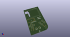
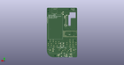
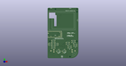

# OOMP Project  
## 1bitsy-1up  by 1Bitsy  
  
oomp key: oomp_projects_flat_1bitsy_1bitsy_1up  
(snippet of original readme)  
  
  
  
This repository contains the board and code used on the 1Bitsy 1UP.  
  
-- Intro  
  
1Bitsy 1UP is a retro inspired handheld game console, the design is based  
around the following __semi arbitrary constraints and requirements.__  
  
* Formfactor: PCB the size of the inside of a GB DMG (the gray one) This will  
  hopefully eventually allow us to put the 1UP pcb inside a modified GB DMG  
  case, either original or new molds sold by several online stores.  
* Main CPU: All code should be able to execute on a 1Bitsy that is fitted with  
  an STM32F415RGT6. That particular chip (due to the package size) does not  
  contain external ram support or LCD display engine. Making LCD drive little  
  bit more tricky. It is a nice constraint that makes coding for the platform  
  bit more of a challenge in the style of classic conloles and 8bit computers  
  because it does not have enough memory for a full framebuffer. ("racing the  
  beam" FTW)  
* Main CPU Mounting: The board contains the 1Bitsy compatible low profile  
  socket using [SL-115-TT-19](https://www.samtec.com/products/sl-115-tt-19)  
  and [BBL-115-T-E](https://www.samtec.com/products/bbl-115-t-e) Samtec  
  connectors as well as one MillMax PogoPin spring loaded SMD connector.  
* LCD: The LCD is a 240x320 TFT display with capacitive touch  
  full source readme at [readme_src.md](readme_src.md)  
  
source repo at: [https://github.com/1Bitsy/1bitsy-1up](https://github.com/1Bitsy/1bitsy-1up)  
## Board  
  
  
## Schematic  
  
  
  
[schematic pdf](working_schematic.pdf)  
## Images  
  
  
  
  
  
  
