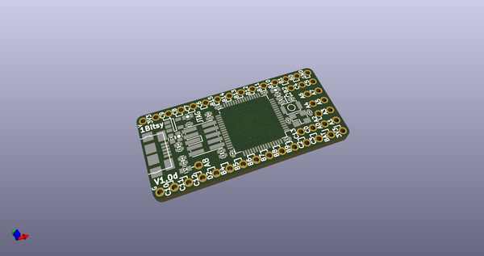
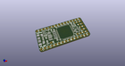
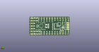
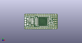

# OOMP Project  
## 1bitsy-hardware  by 1Bitsy  
  
oomp key: oomp_projects_flat_1bitsy_1bitsy_hardware  
(snippet of original readme)  
  
- 1BitSy  
  
  
  
This project includes 1BitSy evaluation boards. These boards are breadboard friendly STM32 (eventually other MCUs will be considered) with exposed Cortex JTAG and SWD interfaces. This allows the use of the Black Magic Probe, instead of the usually very limited built in debugger hardware.  
  
Currently we have the following eval boards:  
  
* 1BitSy V1.0d -> STM32F4x5RGT6  
  
You can find the datasheet of the STM32F415RGT6 chip on the  
[STMicroelectronics website](http://www.st.com/content/st_com/en/products/microcontrollers/stm32-32-bit-arm-cortex-mcus/stm32f4-series/stm32f405-415/stm32f415rg.html).  
  
  
  
  
  
  full source readme at [readme_src.md](readme_src.md)  
  
source repo at: [https://github.com/1Bitsy/1bitsy-hardware](https://github.com/1Bitsy/1bitsy-hardware)  
## Board  
  
  
## Schematic  
  
  
  
[schematic pdf](working_schematic.pdf)  
## Images  
  
  
  
  
  
  
