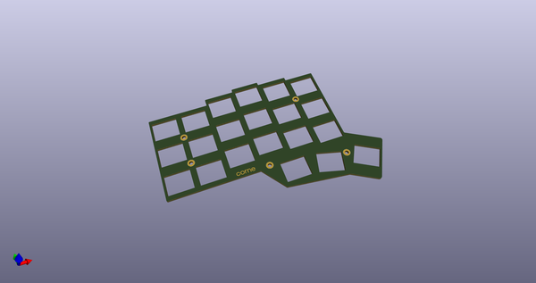
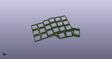
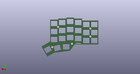
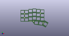

# OOMP Project  
## crkbd  by 50an6xy06r6n  
  
oomp key: oomp_projects_flat_50an6xy06r6n_crkbd  
(snippet of original readme)  
  
- Corne keyboard  
  
The Corne keyboard is a split keyboard with 3x6 column staggered keys and 3 thumb keys,  
based on [Helix](https://github.com/MakotoKurauchi/helix).  
Crkbd stands for Corne Keyboard.  
  
-- Lineup  
  
- corne-classic([JP](corne-classic/doc/buildguide_jp.md)/[EN](corne-classic/doc/buildguide_en.md)):  
    Corne for Cherry MX switches  
- corne-cherry([JP](corne-cherry/doc/buildguide_jp.md)) ([tilting, JP](corne-cherry/doc/v2/buildguide_tilting_tenting_plate_jp.md)):  
    Hotswappable Corne for Cherry MX switches by kailh PCB sockets.  
- corne-chocolate([JP](corne-chocolate/doc/buildguide_jp.md)/[EN](corne-chocolate/doc/buildguide_en.md)):  
    Hotswappable Corne for Chocolate switches using Kailh PCB hot-swap sockets.  
- corne-light([JP](corne-light/doc/buildguide_jp.md)):  
    Light-weight Corne (Easy build with a simple PCB).  
  
-- Photos  
  
  
  
  
  
  
  
  
source repo at: [https://github.com/50an6xy06r6n/crkbd](https://github.com/50an6xy06r6n/crkbd)  
## Board  
  
  
## Schematic  
  
  
  
[schematic pdf](working_schematic.pdf)  
## Images  
  
  
  
  
  
  
