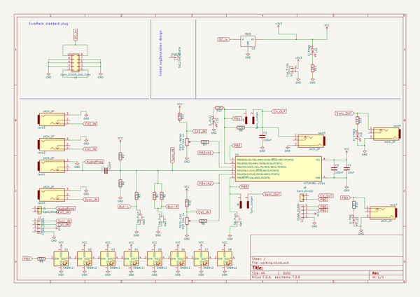

# OOMP Project  
## 8Bit_EuroRack-7hp  by 8BitMixtape  
  
(snippet of original readme)  
  
- 8Bit_EuroRack-7hp  
8Bit Mixtape goes Modular!! Due to popular requests... adapted and improved the mixtape circuit to fit into standard Eurorack Modular format  
  
Join and follow our discussion on the forum:  
  
https://8bitmixtape.discourse.group/t/eurorack-rebooted/47/4  
  
- Features  
  
-- 7hp more space for style!  
  
-- Two board design  
  
Maybe the Eurorack scene like to have more this kinda standard double-decker style  
  
-- 0.1 Prototype - WORKING  
  
  
--- to improve  
  
* Put 2 Neopixel und the potentiometers each  
* switch position of Chip and Buttons to create more space between pot and buttons  
* optimize position of jacks and pots (sub-millimeter improvements)  
* What kinda buttons to use????  
* create nice front plates  
* anything else?  
  
-- Schematic  
  
  full source readme at [readme_src.md](readme_src.md)  
  
source repo at: [https://github.com/8BitMixtape/8Bit_EuroRack-7hp](https://github.com/8BitMixtape/8Bit_EuroRack-7hp)  
## Board  
  
  
## Schematic  
  
  
  
[schematic pdf](working_schematic.pdf)  
## Images  
  
  
  
  
  
  
