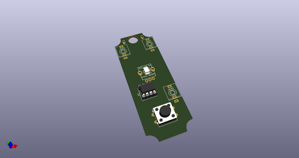
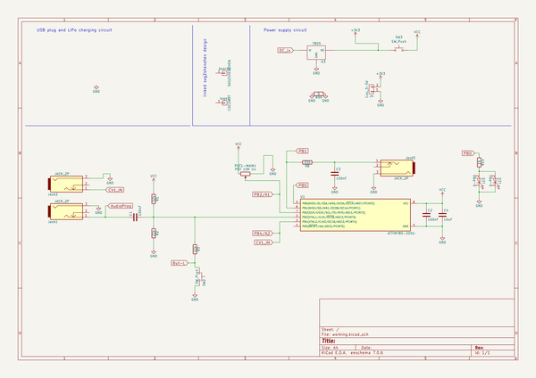
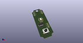
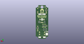
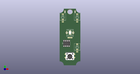

# OOMP Project  
## 8Bit_JogjaNoise  by 8BitMixtape  
  
(snippet of original readme)  
  
- 8Bit NoiseBomb - Jogjarmageddon  
  
8Bit Mixtape goes minimal stompbox style for simple NoiseBomb!!  
  
  
  
  
It is a lo-fi 8Bit noise synthesizer based on the Arduino-compatible ATTINY85, featuring 1 Pot, 1 Button and a single LED inside the potentiometer shaft. Multiple NoiseBombs can be connected to each other using CV input/output and synced to other standard gear (KORG, Pocket Operators and more).  
  
- Features  
  
-- New Bootloader for instant Noise  
  
The key feature of the new 8Bit NoiseBomb is the easiness of uploading new codes using an audio communication protocol, means just playing a .wav sound file from your computer/smart phone (or walkman). Adjust volume to 50-70% if you encounter troubles during upload.  
  
See more about this super powerful and easy-to-use TinyAudioBoot by Christoph Haberer here:  
https://github.com/ChrisMicro/TinyAudioBoot  
  
-- Blinke Potentiometer  
  
-- 1 x CV input  
  
-- 1 Push Button  
  
-- diversity of Jacks 3.5 and 6.5 option  
  
- PCB  
  
We tried to create a PCB design that fits into a Hammond 1590A box, but also can be used stand-alone, and etched by hand single sided.  
  
  
  
- Schematic  
  
  
  
- Sound / Noise Software  
  
-- Community contributions  
  
Choose from a large collection of community cont  
  full source readme at [readme_src.md](readme_src.md)  
  
source repo at: [https://github.com/8BitMixtape/8Bit_JogjaNoise](https://github.com/8BitMixtape/8Bit_JogjaNoise)  
## Board  
  
  
## Schematic  
  
  
  
[schematic pdf](working_schematic.pdf)  
## Images  
  
  
  
  
  
  
