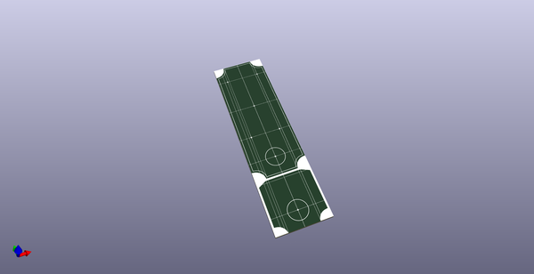
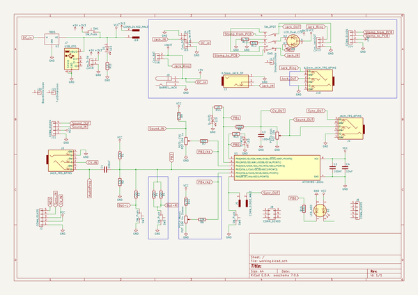
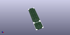
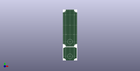

# OOMP Project  
## ATinyStomp  by 8BitMixtape  
  
oomp key: oomp_projects_flat_8bitmixtape_atinystomp  
(snippet of original readme)  
  
- ATinyStomp  
  
  
  
-- KiCAD version of 8Bit Mixtape  
  
  
  
See folder ATinyStompbox. And a dedicated custom footprint library "8BitMixtape_Stomp.pretty"  
  
-- Schematic  
  
  
  
  
  
  
  full source readme at [readme_src.md](readme_src.md)  
  
source repo at: [https://github.com/8BitMixtape/ATinyStomp](https://github.com/8BitMixtape/ATinyStomp)  
## Board  
  
  
## Schematic  
  
  
  
[schematic pdf](working_schematic.pdf)  
## Images  
  
  
  
  
  
  
