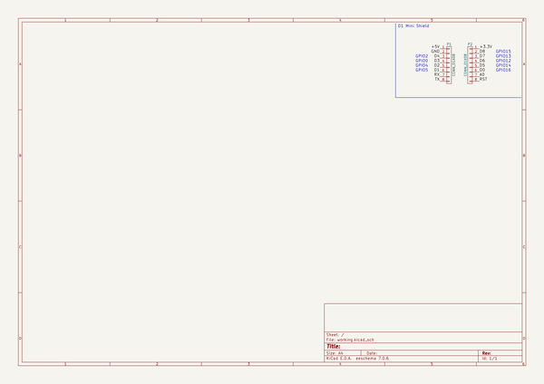
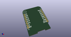
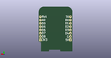
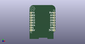

# OOMP Project  
## ESPTINY86_MixtapePCB  by 8BitMixtape  
  
(snippet of original readme)  
  
- ESPTINY86_MixtapePCB  
  
  
  
See more about the ESPTINY86 on https://github.com/esptiny86  
  
- Where to get it  
  
http://shop.8bitmixtape.cc/product/esptiny86-wifi-32bit-mixtape/  
  
- Make Your Own   
  
-- Preview of PCB gerber files  
  
  
  
  
  
-- How to solder it  
  
Check the parts placement .pdf and warm up your soldering iron  
  
  
  
  
  
  full source readme at [readme_src.md](readme_src.md)  
  
source repo at: [https://github.com/8BitMixtape/ESPTINY86_MixtapePCB](https://github.com/8BitMixtape/ESPTINY86_MixtapePCB)  
## Board  
  
  
## Schematic  
  
  
  
[schematic pdf](working_schematic.pdf)  
## Images  
  
  
  
  
  
  
