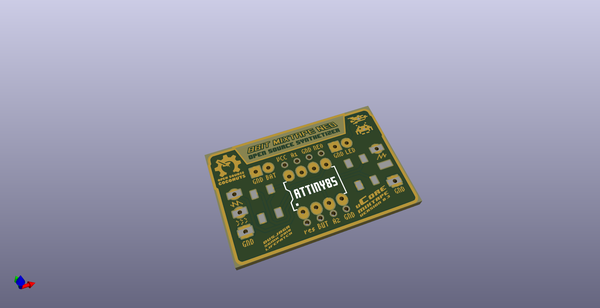
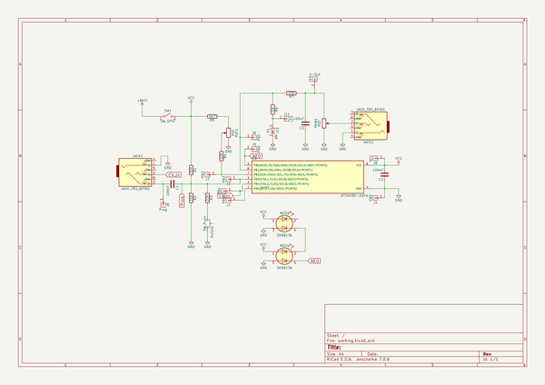
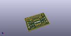
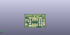
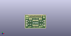

# OOMP Project  
## mCore_Mixtape  by 8BitMixtape  
  
oomp key: oomp_projects_flat_8bitmixtape_mcore_mixtape  
(snippet of original readme)  
  
- mCore_Mixtape  
A minimal barebone PCB for making your own 8Bit Mixtape and custom interface  
  
  
  
- Gerber files v0.3 ready for manufacturing  
  
  
- See/order on Kitspace  
  
https://kitspace.org/boards/github.com/8bitmixtape/mcore_mixtape/  
  
  
  
  full source readme at [readme_src.md](readme_src.md)  
  
source repo at: [https://github.com/8BitMixtape/mCore_Mixtape](https://github.com/8BitMixtape/mCore_Mixtape)  
## Board  
  
  
## Schematic  
  
  
  
[schematic pdf](working_schematic.pdf)  
## Images  
  
  
  
  
  
  
