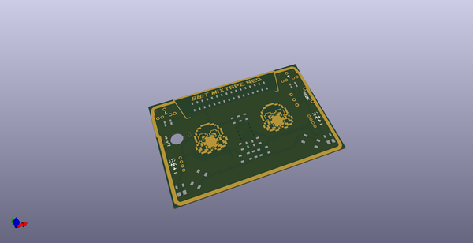
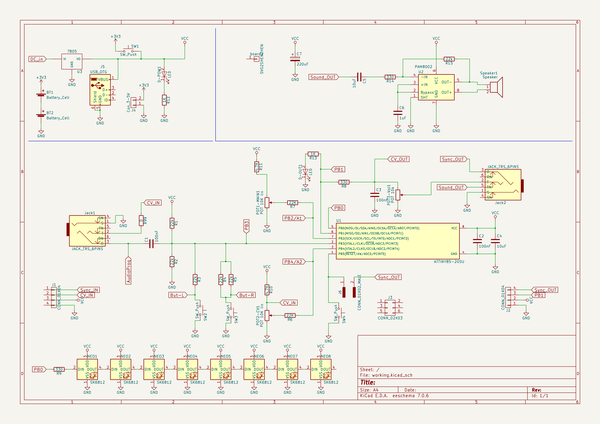
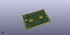
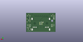
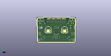

# OOMP Project  
## MixtapeNEO-3000  by 8BitMixtape  
  
oomp key: oomp_projects_flat_8bitmixtape_mixtapeneo_3000  
(snippet of original readme)  
  
- MixtapeNEO-3000  
It's not really new... but finally fully working wiht KiCAD and svg2Shenzhen  
  
  
  
-- KiCAD complete schematic  
  
  
  
--- To Add  
* LiPo charge management  
* (ISP connector)  
  
-- KiCAD dedicated footprints  
  
  
  
Stuff to fix/check:  
* position of battery holders  
* position of hole for battery holder  
* size of Push-Switch hole  
* accoustic holes for speaker/sound  
*   
  
-- creative design layer in Inkscape with svg2shenzhen extension  
  
  
  
Empty canvas in inkscape for creating all kind of creative PCB designs, edge.cut and drill layer taken from earlier editions. Use svg2shenzhen extension to export the footpring .kicad_mod to the dedicated footprint library.  
  
https://github.com/badgeek/svg2shenzhen  
  
  full source readme at [readme_src.md](readme_src.md)  
  
source repo at: [https://github.com/8BitMixtape/MixtapeNEO-3000](https://github.com/8BitMixtape/MixtapeNEO-3000)  
## Board  
  
  
## Schematic  
  
  
  
[schematic pdf](working_schematic.pdf)  
## Images  
  
  
  
  
  
  
