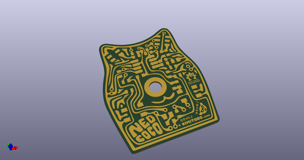
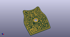
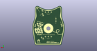
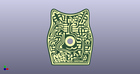

# OOMP Project  
## Neocococat  by 8BitMixtape  
  
oomp key: oomp_projects_flat_8bitmixtape_neocococat  
(snippet of original readme)  
  
- Neocococat  
Board modification of 8Bitmixtape NEO synthesizer  
  
  
  
Neocococat is a board variation from the 8Bitmixtape-NEO circuit and board. 8Bitmixtape is a DIY sound synthesizer electronic circuit using inexpensive and Arduino compatible Attiny85 chip, few very basic components and easy-to-use code uploader using audio jack instead of a USB interface. Please dive in to vast collection of info & material from the following link.  
  
[8Bitmixtape-NEO](http://8bitmixtape.github.io)  
  
Neocococat was designed in Taipei, Dimensionplus April 2017, after Marc Dusseillers 8bitmixtape-NEO DIY pcb etching and (smd) soldering workshop. The circuit is almost identical to 8Bitmixtape-NEO, differences being: 1) only one potentiometer (place for the second pot with the resistors are included on the top of the board) and 2) two NEOpixels instead of 8 as the cat's eyes. All the 8Bitmixtapeneo code should be compatible. I hope I have a chance to contribute also some code derived from the vast collection of fantastic examples at some point. Feel free to copy, remix, do-what-ever-you-want with the board design. Open Source Hardware and coconuts :)  
  
Following information is mainly notes-to-self, but hopefully develops to useful documentation for others.  
  
- V01 : DIY-pcb  
  
-- Drawing the circuit in Inkscape  
  
  
  
source repo at: [https://github.com/8BitMixtape/Neocococat](https://github.com/8BitMixtape/Neocococat)  
## Board  
  
  
## Schematic  
  
  
  
[schematic pdf](working_schematic.pdf)  
## Images  
  
  
  
  
  
  
