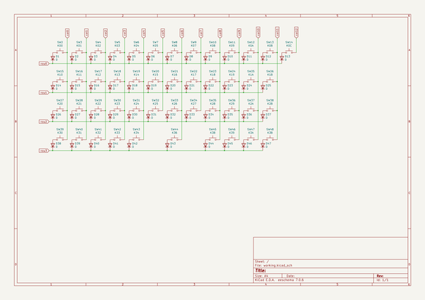

# OOMP Project  
## CC45  by aaarsene  
  
oomp key: oomp_projects_flat_aaarsene_cc45  
(snippet of original readme)  
  
- CC45  
  
THIS IS A WORK IN PROGRESS  
  
⚠️ **Switch spacing is 19mm** ⚠️  
  
[Interactive BOM](http://htmlpreview.github.io/?https://github.com/aaarsene/CC45/blob/master/bom/ibom.html)  
  
-- Supported layouts  
  
  
  
  
-- PCB Render  
  
  
  
  
  
  full source readme at [readme_src.md](readme_src.md)  
  
source repo at: [https://github.com/aaarsene/CC45](https://github.com/aaarsene/CC45)  
## Board  
  
  
## Schematic  
  
  
  
[schematic pdf](working_schematic.pdf)  
## Images  
  
  
  
  
  
  
