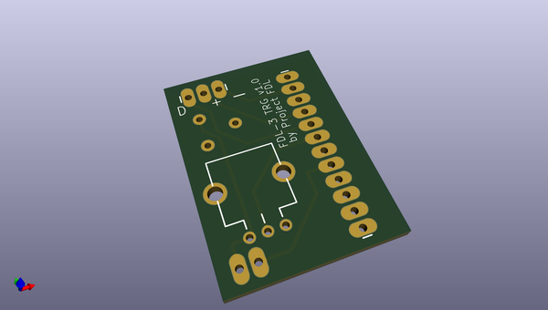
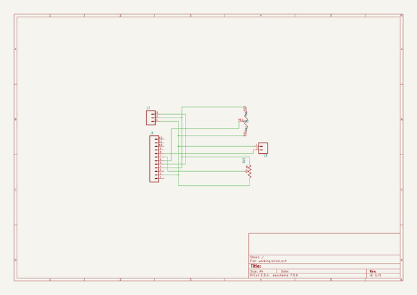

# OOMP Project  
## FDL-3-Blaster  by aaarsene  
  
oomp key: oomp_projects_flat_aaarsene_fdl_3_blaster  
(snippet of original readme)  
  
  
  
    
- FDL-3-Blaster  
  
Welcome to the FDL-3 blaster repository  
  
  
-- This project is licensed under the terms of the Creative Commons Non-Commercial Attribution Share Alike 4.0 license  
Print it, tweak it, share it and if you do and give us props. Please don't sell it without Project FDL permission.  
  
   
   
  
- Operating your FDL-3  
  
    
  
-- Settings (Applicable to full auto tail, firmware version 1.05)  
  
    
  
**Speed**   
Value: 0 - 100 : Default: 50   
Speed or power setting used to adjust the velocity the blaster fires darts.    
  
**ROF (Rate of Fire)**   
Value: 0 - 100 : Default: 100   
Rate of fire setting to adjust time between each dart fired when in burst or full auto.    
  
**Burst**   
Value: 1, 2, 3, F : Default: 1   
Number of darts fired per single trigger pull. F (full auto) will continue firing darts until you release the trigger.    
  
**MinSpin (Minimum Spinup)**   
Value: 120 - 500 : Default: 220   
Time in milliseconds for motors to spinup between trigger pull and firing dart when speed set to 0.    
  
**MaxSpin (Maximum Spinup)**   
Value: 150 - 500 : Default: 200   
Time in milliseconds for motors to spinup between trigger pull and firing dart when speed set to 100.  
Note: MinSpin and MaxSpin together create a range of spinup time. When speed is set to 50, spinup time is half way between MinSpin and MaxSpin. Eg. MinSpin = 200, MaxSpin = 300, Speed =   
  full source readme at [readme_src.md](readme_src.md)  
  
source repo at: [https://github.com/aaarsene/FDL-3-Blaster](https://github.com/aaarsene/FDL-3-Blaster)  
## Board  
  
  
## Schematic  
  
  
  
[schematic pdf](working_schematic.pdf)  
## Images  
