# OOMP Project  
## SST60  by aaarsene  
  
oomp key: oomp_projects_flat_aaarsene_sst60  
(snippet of original readme)  
  
- SST60  
  
-- Fully open source multi-layout 60% PCB  
  
  
 renders outdated, using the old outline.   
  
-- Layout support  
  
  
-- Features  
- RGB Underglow  
- RP2040 processor  
- MX and Alps compatible  
- Indicator light positions for Caps Lock and Esc  
- Standard tray mount support  
- Gummy O-Ring support (Bakenko, ogre, etc. anything that h60 supports, this does too.)  
- USB-C or Unified Daughterboard (or equivalent with the same pinout)  
- Overcurrent and ESD protection  
- Flex meme cuts  
  
-- ***DISCLAIMER***  
This PCB has been tested and confirmed to work properly. The members of the PCB development team are not liable if you end up with a non-functional pcb. Order at your own risk. Support will not be provided but pull requests will be reviewed and possibly accepted.  
  
  full source readme at [readme_src.md](readme_src.md)  
  
source repo at: [https://github.com/aaarsene/SST60](https://github.com/aaarsene/SST60)  
## Board  
  
[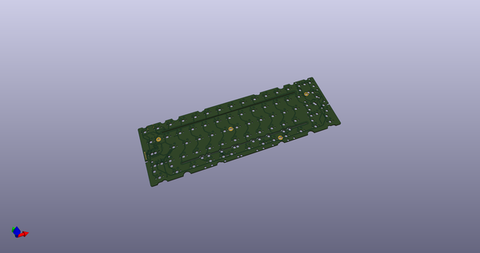](working_3d.png)  
## Schematic  
  
[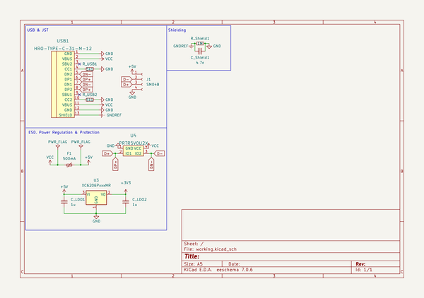](working_schematic.png)  
  
[schematic pdf](working_schematic.pdf)  
## Images  
  
[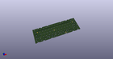](working_3d.png)  
  
[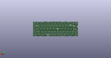](working_3d_back.png)  
  
  
  
[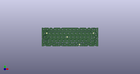](working_3d_front.png)  
  
[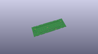](working_3D_top.png)  
  
[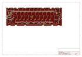](working_assembly_page_01.png)  
  
[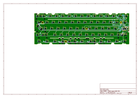](working_assembly_page_02.png)  
  
[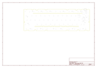](working_assembly_page_03.png)  
  
[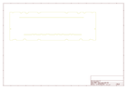](working_assembly_page_04.png)  
  
[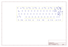](working_assembly_page_05.png)  
  
  
