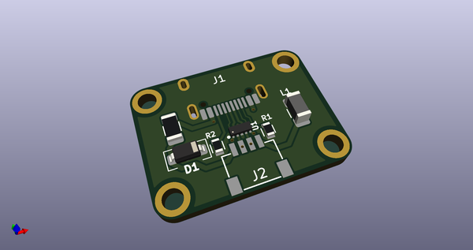
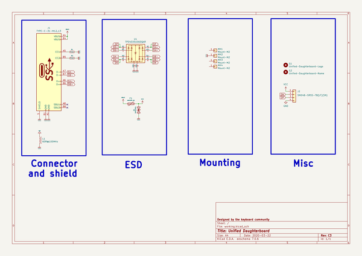
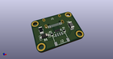
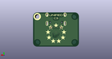
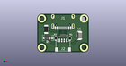

# OOMP Project  
## Unified-Daughterboard  by aaarsene  
  
(snippet of original readme)  
  
- Unified Daughterboard Project  
  

  
    

  

  
    

  
  
-- Introduction  
The Unified Daughterboard Project is an attempt by leading designers in the mechanical keyboard community to standardize the USB daughterboards used for their custom mechanical keyboard projects. It has initially been envisioned by users ai03, Wilba, Hineybush, Xelus, Xondat, aeryxz and Maximillian.  
  
The main characteristic of this daughterboard is to integrate a USB Type C connector and the needed circuitry for USB2.0 operation in a small PCB that can be screwed to a keyboard chassis; this significantly simplifies the assembly and design of the main circuit board.  
  
-- C3 version  
  
In its latest version, C3, this daughterboard features:  
  
* ESD (Electrostatic Discharge) protection on the data lines of the USB connector through a specialized chip;  
* Overcurrent protection through a PTC fuse;  
* Overvoltage protection through a bidirectional TVS diode;  
* Shielding noise decoupling capabilities through a ferrite bead;  
* Single-path grounding of the metallic chassis to which the daughterboard is attached.  
  
Adittionally, the C3 version is backwards compatible with both C1 and C2 versions since it has the same dimensions and us  
  full source readme at [readme_src.md](readme_src.md)  
  
source repo at: [https://github.com/aaarsene/Unified-Daughterboard](https://github.com/aaarsene/Unified-Daughterboard)  
## Board  
  
  
## Schematic  
  
  
  
[schematic pdf](working_schematic.pdf)  
## Images  
  
  
  
  
  
  
