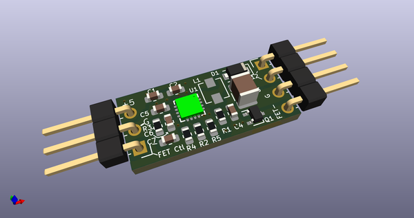
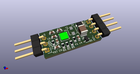
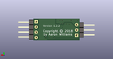
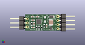

# OOMP Project  
##   by   
  
oomp key:   
(snippet of original readme)  
  
- 12v-Boost-Fan-Control  
This is a small board designed to boost 3-8v (typically 5v) up to 12v.   
In addition, it contains a N-channel mosfet which can be used to turn  
a device on or off or to perform PWM on something like a fan.  
  
This board was designed to efficiently power 12v computer fans using as  
small a footprint as possible.  While it's certainly possible to go  
smaller, this uses 0603 and larger devices.  
  
On the input side there is +5, ground and a FET control line.  To  
enable the FET as a ground type device, pull the FET control line  
to 3v or higher and connect the device between +12 and FET-.  Note  
that when the fet is not activated that the FET- will not provide   
ground.  
  
  full source readme at [readme_src.md](readme_src.md)  
  
source repo at:   
## Board  
  
  
## Schematic  
  
  
  
[schematic pdf](working_schematic.pdf)  
## Images  
  
  
  
  
  
  
