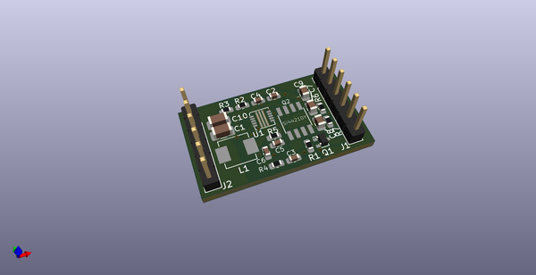
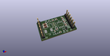
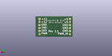
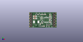

# OOMP Project  
##   by   
  
(snippet of original readme)  
  
- 12v-booster-2  
Second generation 5V to 12V booster  
  
My first generation booster was severely limited in the amount of current it could produce. This second generation is designed to handle 2A.  
  
J2 is the input with the following pin designations:  
1: +5V  
2: +5V  
3: GND  
4: GND  
5: GND  
6: PWM_CTL - this drives the PWM mosfet gate with a 100K pull-down  
  
J1 is the output with the following pin designations:  
1: +12V  
2: +12V  
3: GND  
4: GND  
5: GND  
6: PWM output pulled to ground when PWM_CTL is high  
  
  full source readme at [readme_src.md](readme_src.md)  
  
source repo at:   
## Board  
  
  
## Schematic  
  
  
  
[schematic pdf](working_schematic.pdf)  
## Images  
  
  
  
  
  
  
