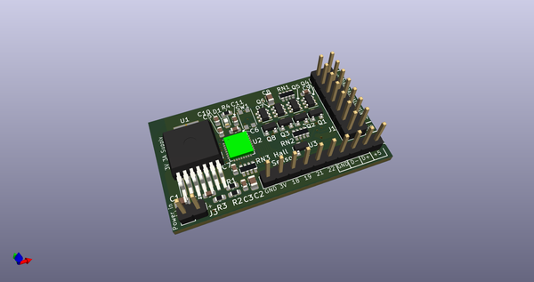

# OOMP Project  
##   by   
  
(snippet of original readme)  
  
- 3v-pwm-controller  
An Arduino M0 PWM controller with 3 mosfets designed to perform PWM at 3V  
with a 3A 3V supply  
  
This PWM controller provides 3 PWM channels designed to source and sink current.  
The PWM signals are configured as an H-bridge with 6 GPIO pins controlling it.  
One set of GPIO pins controlls the P-channel mosfets and another set controls  
the N-channel mosfets.  
  
Do not pull the P-channel mosfets low while pulling the attached N-channel  
mosfet high! This will create a short and cause the 3V power supply to  
overheat anb hopefully shut down! Bad things happen!  
  
If you can't control both N and P channels simultaneously, set the P-channel  
high and the N-channel low as an intermediate step.  
  
PW0: P-channel = PA02, N-channel = PA05  
PW1: P-channel = PA01, N-channel = PA04  
PW2: P-channel = PA00, N-channel = PA03  
  
For example, to pull PW0 high and PW1 low and PW2 high impedence (open),  
set PA02 low, PA05 low, PA01 high, PA04 high, PA00 high, PA03 low.  
  
  
The 3V supply is capable of providing up to 3A of current and is designed  
to be powered by a 5V supply.  
  
Each PWM channel should be able to handle at least 3A of current at 3V.  
The MOSFETs are rated at over 5A each.  
  
J1:  
1: +5V  
2: +5V  
3: PWM0 GNR controlled by pulling PA05 high, +3 controlled by pulling PA02 low  
4: PA08  
5: PWM1 GND controlled by pulling PA04 high, +3 controlled by pulling PA01 low  
6: PA09  
7: PWM2 GND controlled by pulling PA03 high, +3 controlled by pulling PA00 low  
8: PA10  
9: +3V  
10: +3V  
11: GND  
12: GND  
  
J2  
  full source readme at [readme_src.md](readme_src.md)  
  
source repo at:   
## Board  
  
  
## Schematic  
  
  
  
[schematic pdf](working_schematic.pdf)  
## Images  
  
  
  
  
  
  
