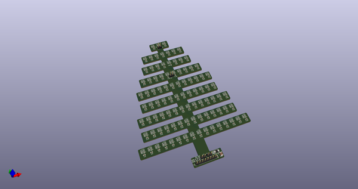
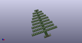
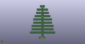
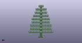

# OOMP Project  
##   by   
  
oomp key:   
(snippet of original readme)  
  
- ears-ws2813-mini  
New flex board LED project using ws2812-minis instead of sk6812-3535s. Hopefully this will be less sensitive to heat.  
  
  full source readme at [readme_src.md](readme_src.md)  
  
source repo at:   
## Board  
  
  
## Schematic  
  
  
  
[schematic pdf](working_schematic.pdf)  
## Images  
  
  
  
  
  
  
