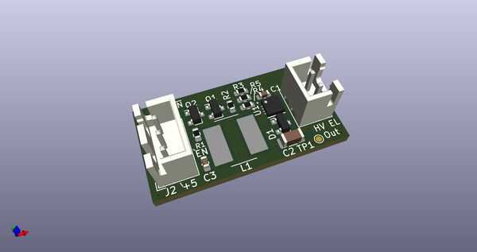
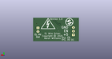
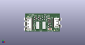

# OOMP Project  
##   by   
  
(snippet of original readme)  
  
- el-driver-3  
EL Wire Driver using Microchip MIC4832  
  
Copyright (C) 2021 Aaron Williams  
  
The enable pin is active high and requires 3V up to VCC.  It is pulled  
low by a 1M resistor.  This board is optimized for 100Hz and 3 square inches  
of EL panel.  
  
VCC is 3-5V  
  
Note that C2 must be rated for 250VDC or higher.  
  
See page 11 of the MIC4832 datasheet at:  
https://ww1.microchip.com/downloads/en/DeviceDoc/MIC4832-Low-Noise-220VPP-EL-Driver-DS20006163A.pdf  
  
  full source readme at [readme_src.md](readme_src.md)  
  
source repo at:   
## Board  
  
  
## Schematic  
  
  
  
[schematic pdf](working_schematic.pdf)  
## Images  
  
  
  
  
  
  
