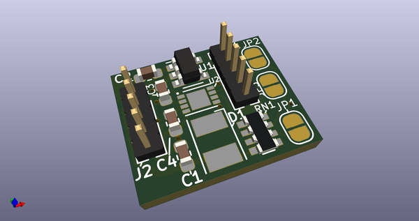
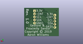
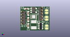

# OOMP Project  
##   by   
  
(snippet of original readme)  
  
This tiny board provides a proximity and gesture sensor with i2c hookups.  
  
If i2c and interrupt termination is not required, do not install RN1  
and/or cut JP1 for /INT, JP2 for /SCL and JP3 for SDA.  
  
The board is designed to pass-through all signals.  Note that the LED  
can use up to 100ma.  
  
The pin headers are also 1.27mm, not 2.54mm since this board is designed  
to be tiny.  It measures 14.29mm x 11.81mm.  
  
The board is based off of the ADUX1020 gesture and proximity sensor and a   
Vishay VSMY3940X01-GS08 infra-red LED.  The LED can draw up to 100ma.  
  
The board requires 3V for power and includes a 1.8V LDO.  
  
  full source readme at [readme_src.md](readme_src.md)  
  
source repo at:   
## Board  
  
  
## Schematic  
  
  
  
[schematic pdf](working_schematic.pdf)  
## Images  
  
  
  
  
  
  
