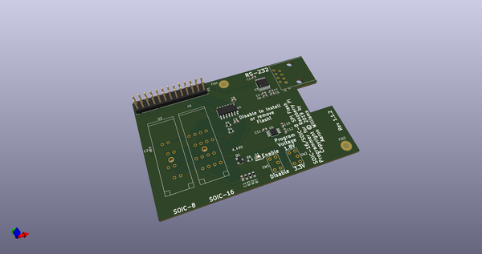

# OOMP Project  
##   by   
  
(snippet of original readme)  
  
Note that there are some issues with this programmer. I suggest moving to  
raspberry-pi-spi-programmer2 instead.  No more development will happen for  
this.  
  
SOIC-8 and SOIC-16 SPI Flash Programmer for Raspberry PI  
  
This hat allows the Raspberry PI to program both SOIC-8 and SOIC-16 SPI  
NOR devices at 1.8 and 3.3 volts.  The programmer can be enabled either  
from SW1 or via GPIO 22. If using GPIO 22 then leave the SW1 in the  
Enabled position. LED D1 will light up when the programmer is enabled.  
Make sure that the programmer is disabled when inserting or removing  
SPI devices.  
  
SW2 allows either 1.8 or 3.3 volts to be used for programming. Make sure  
that the programmer is disabled before selecting the appropriate voltage.  
A future version of this board may allow this to be set by GPIO pins  
as well.  
  
All resistors, capacitors and the LED are 0603 devices.  For capacitors,  
use X7R and the higher the voltage the better.  The LED should be capable  
of handling 7ma of current.  The recommendation is to use a red LED.  
  
The serial port support is optional.  
Additionally, if only SOIC-8 or SOIC-16 devices are to be programmed, the  
other socket does not need to be stuffed.  
  
All parts can be found at https://digikey.com  
  
=========== Using ==============  
  
Do not install SPI NOR flash devices in both sockets at the same time.  A  
future version of this board may support devices in both sockets.  
  
1. Make sure that the programmer is disabled and that the LED is off.  
2. Select the proper voltage fo  
  full source readme at [readme_src.md](readme_src.md)  
  
source repo at:   
## Board  
  
  
## Schematic  
  
  
  
[schematic pdf](working_schematic.pdf)  
## Images  
  
  
  
  
  
  
