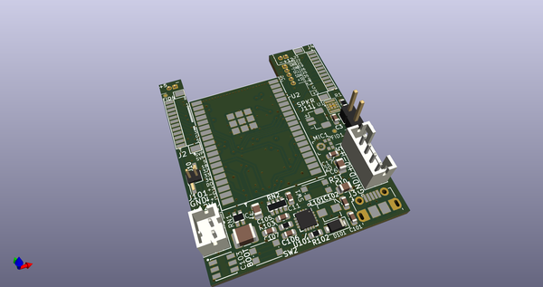
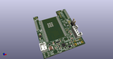
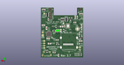
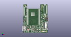

# OOMP Project  
##   by   
  
oomp key:   
(snippet of original readme)  
  
SOIC-8 and SOIC-16 SPI Flash Programming Hat for Raspberry PI  
  
This hat allows the Raspberry PI to program both SOIC-8 and SOIC-16 SPI  
NOR devices at 1.8 and 3.3 volts.  All features of this programmer can  
be controlled via software.  
  
While the current version of the board has switches and jumpers present,  
a future version of this board will no longer require them since everything  
can be controlled by GPIO pins.  
  
SW1: This switch will enable and disable the programmer.  When disabled,  
the power and signals to the sockets will be disabled and SPI NOR chips  
may be safely installed or removed.  Software is able to read this switch  
and a future software version will be able to override the switch.  
  
SW2: This sets the voltage to use for powering and programming the SPI NOR  
chips.  Software can read the position of this switch and a future version  
of the software will be able to both read and override the switch setting.  
  
JP1: This jumper should be installed if the board this hat is plugged into  
does not support SPI chip select 1.  For example, the Rock64Pro board does  
not provide CS1.  Software can read whether this jumper is installed or not  
and can override the jumper.  A future version of the software will not  
need the jumper since it will detect what type of board it is running on.  
  
The SOIC-16 socket will only run in single lane mode.  Lanes 1, 2 and 3  
are not supported by the Raspberry PI.  
  
LEDs:  
This board has 6 LEDs.  
  
Power: D6: The white LED in the upper left will be lit   
  full source readme at [readme_src.md](readme_src.md)  
  
source repo at:   
## Board  
  
  
## Schematic  
  
  
  
[schematic pdf](working_schematic.pdf)  
## Images  
  
  
  
  
  
  
