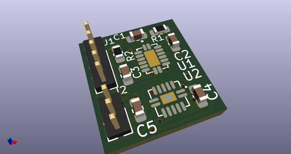
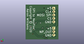
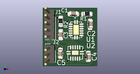

# OOMP Project  
##   by   
  
oomp key:   
(snippet of original readme)  
  
- spi_to_neopixel  
SPI to NeoPixel circuit  
  
This is based on Ben Heck's ciurcuit at https://github.com/benheck/SPI-Neopixel  
  
This takes an 800KHz SPI input and outputs the timing needed to drive WS2812 NeoPixels  
without requiring any bit banging.  
  
All components can be found on Digikey.  
  
Note that this has NOT been tested.  I'm using the HC instead of the LS parts and I do  
not know if this will make a difference.  
  
  full source readme at [readme_src.md](readme_src.md)  
  
source repo at:   
## Board  
  
  
## Schematic  
  
  
  
[schematic pdf](working_schematic.pdf)  
## Images  
  
  
  
  
  
  
