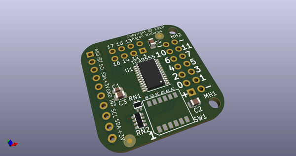
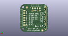
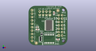

# OOMP Project  
##   by   
  
oomp key:   
(snippet of original readme)  
  
TCA9555A i2c GPIO expander board  
  
I am doing an ESP32 Wrover based design and I need additional GPIO pins to  
monitor 10 hall effect sensors. I want to generate an interrupt whenever one  
of them is triggered. This board is designed so that I can plug my existing  
ribbon cable directly into J2 (with the pins installed on the back of the  
board) with J3 providing the rest of the pins.  
  
J1 provides power, ground, interrupt, i2c SDA and i2c SCL signals.  All of  
the signals are duplicated so that the boards can be chained together by  
alternating 5-pin male and female header.  
  
The TCA9555A is capable of 400KHz i2c.  
It can generate an interrupt whenever one of the unmasked pins changes state.  
  
The switches are as follows:  
  
1: Enable the interrupt pull-up.  This should only be on for the last  
   board in the i2c chain.  
2: Enable SDA pull-up.  This should only be on for the last board in the  
   i2c chain.  
3: Enable SCL pull-up.  This should only be on for the last board in the  
   i2c chain.  
4: Sets the A0 bit 1 when on, 0 when off.  
5: Sets the A1 bit 1 when on, 0 when off.  
6: Sets the A2 bit 1 when on, 0 when off.  
  
A datasheet on the GPIO expander can be found here:  
http://www.ti.com/lit/ds/symlink/tca9555.pdf  
  
The base i2c address is 0x20 and can be adjusted via the A0-A2 switches to  
use addresses 0x20 through 0x27.  
  
Please use insulating washers between any screws and stand-offs when  
mounting this board to prevent shorts between power and ground.  
  
While the board is listed as supportin  
  full source readme at [readme_src.md](readme_src.md)  
  
source repo at:   
## Board  
  
  
## Schematic  
  
  
  
[schematic pdf](working_schematic.pdf)  
## Images  
  
  
  
  
  
  
