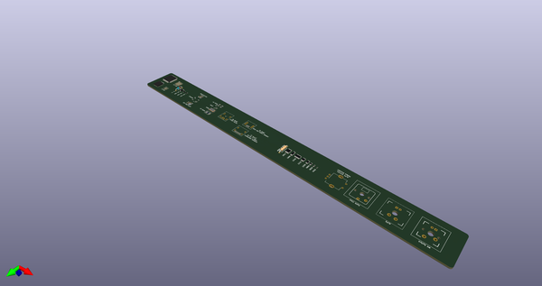
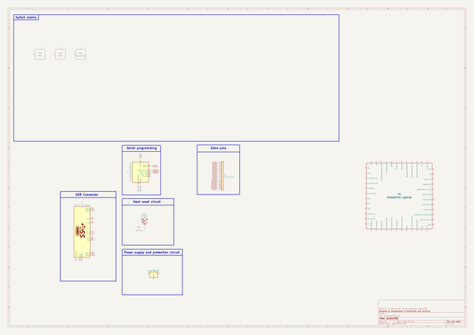
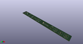

# OOMP Project  
## AcheronRuler  by AcheronProject  
  
oomp key: oomp_projects_flat_acheronproject_acheronruler  
(snippet of original readme)  
  
- Acheron Ruler   
  
  
  
-- PCBWay sponsorship  
  
The pre-revision Alpha of the ArcticPCB was sponsored by [PCBWay](http://www.pcbway.com), a big asian PCB manufacturer that provided prototypes for the Arctic.  
  
The review article can be found at [the AcheronDocs page](https://gondolindrim.github.io/AcheronDocs/pcbway/sponsorship.html).  
  
-- Copyright notice  
  
This project is released under the Acheron Open-Hardware License V1.1. For the license, please refer to the LICENCE.md file.  
  
  full source readme at [readme_src.md](readme_src.md)  
  
source repo at: [https://github.com/AcheronProject/AcheronRuler](https://github.com/AcheronProject/AcheronRuler)  
## Board  
  
  
## Schematic  
  
  
  
[schematic pdf](working_schematic.pdf)  
## Images  
  
  
