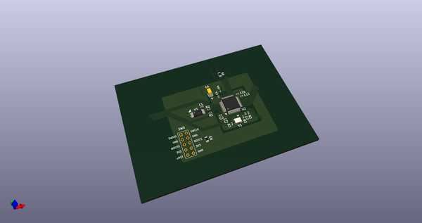
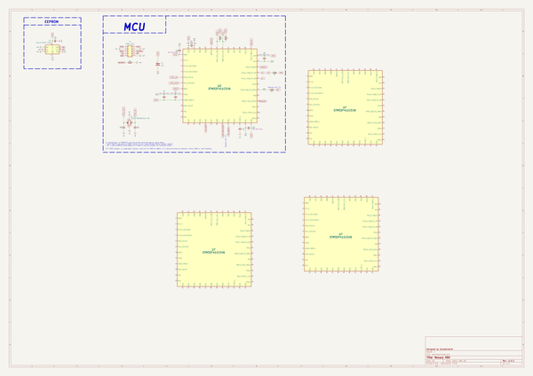
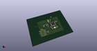
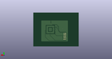
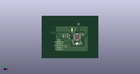

# OOMP Project  
## AcheronSetup  by AcheronProject  
  
oomp key: oomp_projects_flat_acheronproject_acheronsetup  
(snippet of original readme)  
  
- Acheron Setup  
  
-- Introduction  
  
Acheron Setup is a library of materials used by the AcheronProject for setups and configurations, like Makefiles, bash scripts and Dockerfiles that automate some of the work needed to use and maintain a project based on the Acheron Library.  
  
-- Keyboard creator  
  
Creates a ready-to-use KiCAD project for a mechanical keyboard using Makefiles and bash scripts. Several templates are available.  
  
-- KiCAD docker  
  
A Dockerfile and set of commands to build a Docker image and run a container to compile the lates KiCAD nightly binary using pacman and the Arch Linux Docker image.  
  
  full source readme at [readme_src.md](readme_src.md)  
  
source repo at: [https://github.com/AcheronProject/AcheronSetup](https://github.com/AcheronProject/AcheronSetup)  
## Board  
  
  
## Schematic  
  
  
  
[schematic pdf](working_schematic.pdf)  
## Images  
  
  
  
  
  
  
