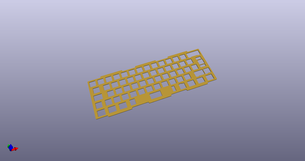
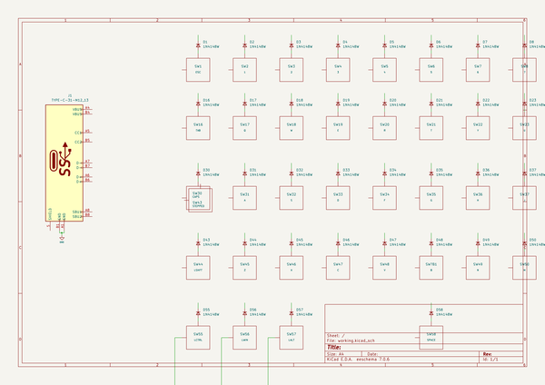
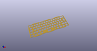
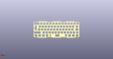
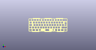

# OOMP Project  
## Alioth  by AcheronProject  
  
oomp key: oomp_projects_flat_acheronproject_alioth  
(snippet of original readme)  
  
- Acheron Alioth PCB  
  

  
     

  
  
See [this page](https://gondolindrim.github.io/AcheronDocs/alioth/intro.html) for the Alioth documentation.  
  
- Features  
  
Alioth is an open-source replacement PCB for the Polaris keyboard. It is powered by an STM32F072 MCU and supports a big array of layout options, including:  
  
- Full and split backspace  
- Full and split right shift  
- ANSI and ISO options  
- Stepped caps lock  
  
Alioth also features:  
  
- Per-key single color LEDs  
- Flex or relief cuts  
- USBC connection  
- QMK firmware compatibility  
  
- Pictures  
  
Yet not available as of june 25, 2020.  
  
- Plate files  
  
In the __polaris_plates__ folder there are the KiCad files for the ANSI and ISO versions of the half and full plates of the Polaris. These files can be submitted to a PCB manufacturer such as Elecrow to be manufactured in FR4 material. There are also SVG vectorized files which can be used to produce these plates in any other material.  
  
- Licensing  
  
Alioth is released under the Acheron Open-Hardware License AOHL version 1.3; see the __LICENSE.md__ file included in the root folder of this repository. However, the files in the ``polaris_resources`` folder were not authored by the Acheron Project but by the original Polaris PCB designer, ai03, and as such are subject to their own licensing. These files were obtained by Gondolindrim from [ai03'  
  full source readme at [readme_src.md](readme_src.md)  
  
source repo at: [https://github.com/AcheronProject/Alioth](https://github.com/AcheronProject/Alioth)  
## Board  
  
  
## Schematic  
  
  
  
[schematic pdf](working_schematic.pdf)  
## Images  
  
  
  
  
  
  
