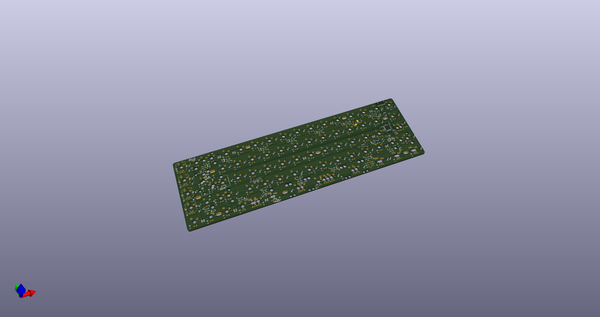
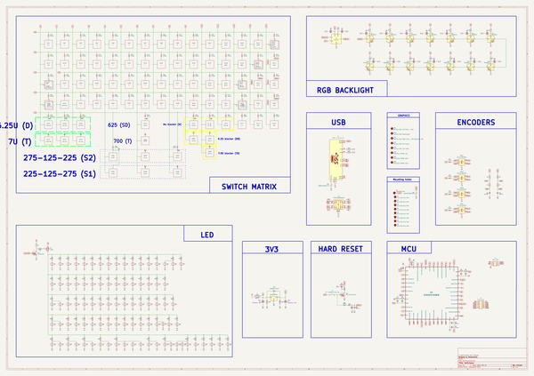
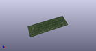
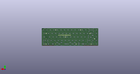
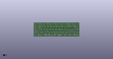

# OOMP Project  
## Anticheww  by AcheronProject  
  
oomp key: oomp_projects_flat_acheronproject_anticheww  
(snippet of original readme)  
  
- Acheron 65-SM-S-STM32-MX-TH-WI (Codename "Anticheww")  
  
  
  
See [this page](https://gondolindrim.github.io/AcheronDocs/anticheww/intro.html) for the Anticheww documentation.  
  
-- Introduction  
  
Anticheww was conceived as an experiment on how many layouts one can support in a single PCB. The current (v2.0.8) version is a universal 65% PCB, compatible with TADA68 and KBD67 (rev. 1 was tested and working, not tested with rev. 2 yet) supporting per-key lighting using single-color LEDs, RGB underglow using WS2812C RGB LEDs, rotary encoders and a multitude of layouts:  
  
- Default ANSI bottom row, with and without the 0.5 units blocker;  
- 7.0 units spaebar bottom row, with and without 0.5 units blocker;  
- 225-125-275 and 275-125-225 split spacebar options;  
- Split backspace;  
- Split left and right shifts;  
- ISO enter;  
- ABNT and ABNT2 layouts.  
  
-- Compatible layouts  
  
Click [here](http://raw.githubusercontent.com/AcheronProject/Anticheww/master/graphics/KLE/anticheww_kle.json) for a JSON file that can be used in [Keyboard Layout Editor](http://keyboard-layout-editor.com).  
  
  
  
-- Contributors  
  
- Chewwy from the [Mechs on Deck](http://twitch.tv/https://www.twitch.tv/mechsondeck) channel, who became the inspiration to make a 65% PCB.  
     
-- Copyright notice  
  
Thi  
  full source readme at [readme_src.md](readme_src.md)  
  
source repo at: [https://github.com/AcheronProject/Anticheww](https://github.com/AcheronProject/Anticheww)  
## Board  
  
  
## Schematic  
  
  
  
[schematic pdf](working_schematic.pdf)  
## Images  
  
  
  
  
  
  
