# OOMP Project  
## Anubis  by AcheronProject  
  
(snippet of original readme)  
  
- Acheron Anubis  
  
Anbis is a solderable tenkeyless (TKL) PCB with solderable MX switch support designed to be compatible with ai03's Andromeda PCB and wilba_tech's WT80.  
  
-- Compatible layouts   
  
Anubis supports a variety of compatible layouts, including:  
  
- 6.25U and 7U spacebar bottom row support  
- Stepped and full caps lock  
- ISO enter and left shit  
- Split right shift  
- Split backspace  
  
-- PCB compatibility  
  
Anubis was originally intended to be compatible with [ai03's Andromeda](https://ai03.com/projects/andromeda/); the Andromeda PCB is open-source. The WT-80 PCB compatibility was achieved by simply adding screw intrusions and cutouts into the Andromeda outline.  
  
There is however a slight problem when it comes to the USB daughterboard connector location: Andromeda uses in a spot, WT80 uses it in another completely different one. Because of this, two JST locations are available, and should be chosen according to which compatibility is needed: connector J2 should be used for Andromeda, and J1 for WT80 compatibility.  
  
The big distance between both JST connectors means that the USB traces from J1 are very long; these long traces would be unconnected if the J2 connector is used instead. To prevent the remaining length to act as antennas, two 0R resistors, R17 and R16, are added; if using J2, these should not be used, and if using J1, these should be used.  
  
In summary:  
  
    - For Andromeda compatibility, populate J2 and leave J1, R16, R17 un-populated;  
    - For WT80 populate J  
  full source readme at [readme_src.md](readme_src.md)  
  
source repo at: [https://github.com/AcheronProject/Anubis](https://github.com/AcheronProject/Anubis)  
## Board  
  
[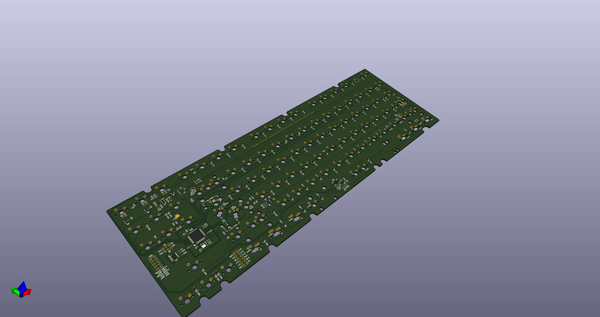](working_3d.png)  
## Schematic  
  
[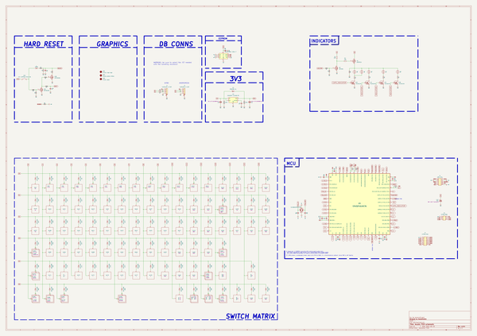](working_schematic.png)  
  
[schematic pdf](working_schematic.pdf)  
## Images  
  
[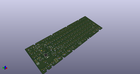](working_3d.png)  
  
  
  
[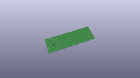](working_3D_top.png)  
  
[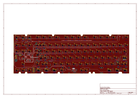](working_assembly_page_01.png)  
  
[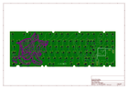](working_assembly_page_02.png)  
  
[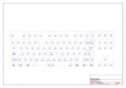](working_assembly_page_03.png)  
  
[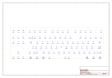](working_assembly_page_04.png)  
  
[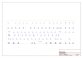](working_assembly_page_05.png)  
  
[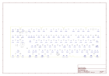](working_assembly_page_06.png)  
  
[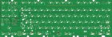](working_top.png)  
