# OOMP Project  
## Apollo87H  by AcheronProject  
  
oomp key: oomp_projects_flat_acheronproject_apollo87h  
(snippet of original readme)  
  
- Acheron Apollo87H  
  
Apollo is a tenkeyless (TKL) keyboard Printed Circuit Board (PCB) which main feature is the per-key RGB lighting. This particular variant, 87H (short convention for 87 keys Hotswap), features an 87-key layout with Kailh hotswap sockets and supports a "default" TKL layout, that is, a 6.25 units spacebar, no split backspace or right shift, and ANSI-only enter.  
  
Go to the [Acheron Docs](http://acheronproject.com/pcbs/apollo/apollo/) for the Apollo87H documentation.  
  
  full source readme at [readme_src.md](readme_src.md)  
  
source repo at: [https://github.com/AcheronProject/Apollo87H](https://github.com/AcheronProject/Apollo87H)  
## Board  
  
[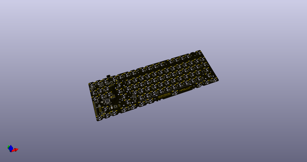](working_3d.png)  
## Schematic  
  
[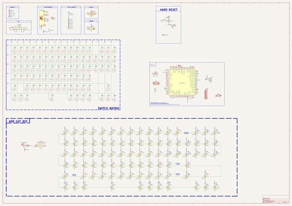](working_schematic.png)  
  
[schematic pdf](working_schematic.pdf)  
## Images  
  
[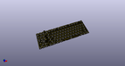](working_3d.png)  
  
[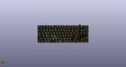](working_3d_back.png)  
  
  
  
[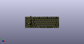](working_3d_front.png)  
  
[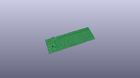](working_3D_top.png)  
  
[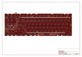](working_assembly_page_01.png)  
  
[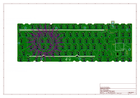](working_assembly_page_02.png)  
  
[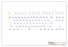](working_assembly_page_03.png)  
  
[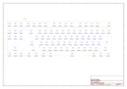](working_assembly_page_04.png)  
  
[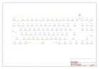](working_assembly_page_05.png)  
  
[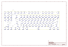](working_assembly_page_06.png)  
