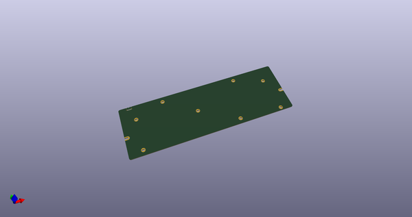
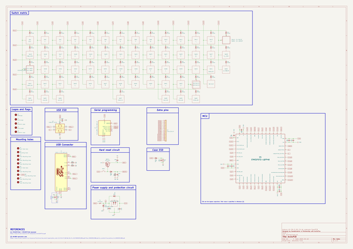
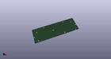
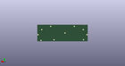
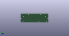

# OOMP Project  
## ArcticPCB  by AcheronProject  
  
oomp key: oomp_projects_flat_acheronproject_arcticpcb  
(snippet of original readme)  
  
- Acheron 60-SM-S-STM32-MX-TH-WI (Codename "ArcticPCB")  
  
  
  
See [this page](https://gondolindrim.github.io/AcheronDocs/arctic/intro.html) for the ArcticPCB documentation.  
  
-- Introduction  
  
Arctic is an STM32F072-based universal 60% keyboard PCB featuring limited layouts and features. The layouts were cherry-picked by enthusiast ArcticFox and consist of only Tsangan bottom row.   
  
This PCB also features "relief" flex cuts aimed at improving keyboard typing feeling.  
  
Arctic hold a very special place in my heart as it was one of the first two PCBs, together with the KeebsPCB, in the Acheron Project and effectively inaugurated it.  
  
-- Contributors  
  
- Raphael "ArcticFox" Hochheim for helping choosing the compatible layouts  
- Felipe 'MrKeebs" Coury who paid for the V1 prototypes and helped immensely by funcing my learning  
- PCBWay for sponsoring the pre-revision Alpha prototypes  
  
-- Supported layouts  
  
Click [this link](http://www.keyboard-layout-editor.com/-/gists/73be427d3e8086a9253feece2dae6974) for the KLE file for the Arctic.  
  
  
  
-- Renders  
  
Click at the images to zoom in.  
  
Renders generated by the [tracespace.io](https://tracespace.io/view/) site.  
  
  
  
  
  
source repo at: [https://github.com/AcheronProject/ArcticPCB](https://github.com/AcheronProject/ArcticPCB)  
## Board  
  
  
## Schematic  
  
  
  
[schematic pdf](working_schematic.pdf)  
## Images  
  
  
  
  
  
  
