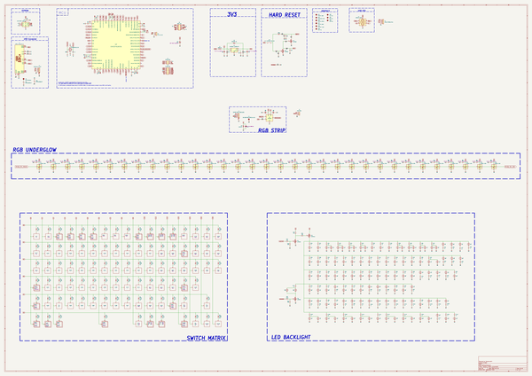

# OOMP Project  
## Athena  by AcheronProject  
  
oomp key: oomp_projects_flat_acheronproject_athena  
(snippet of original readme)  
  
- Acheron Athena  
  
-- Introduction  
  
Athena is a tenkeyless (TKL) keyboard Printed Circuit Board (PCB) which main feature is the multi-layout support. Athena supports:  
  
- 87 (F12) or 88 (F13) TKL function rows;  
- ANSI and ISO layouts  
- 7U and 6.25U spacebar bottom row layouts  
- Split backspace  
- Split right shift  
  
Below is a [Keyboard Layout Editor](http://keyboard-layout-editor.com/) image of the layouts Athena supports.  
  
  
  
In [this link](https://raw.githubusercontent.com/Gondolindrim/file_hosting/main/athena/athena_KLE.json) there is a KLE JSON file for the layout.  
  
Both Apollo and Athena line of PCBs were designed to be "universal" TKL PCBs, that is, designed to fit a wide variety of custom mechanical keyboards. The compatibility list is being built as more people check and test. See the **Keyboard compatibility** section of this README for the available list.  
  
-- Technical information  
  
- Layout size: tenkeykess (TKL)  
- Compatible switches: MX-like only, solderable  
- Lighting: single colors per-key through-hole LEDs, RGB underglow  
- Microcontroller: STM32 family (see [the Joker topologyt documentaton](https://acheronproject.com/multimcu_article/multimcu_article/))  
- Connector: detachable USB Type C on the top side and JST connector for daughterboard support  
- Firmware compatibility: QMK (with VIA support)  
- Protection hardware:  
  * USB data lines and power rail ESD suppressin  
  full source readme at [readme_src.md](readme_src.md)  
  
source repo at: [https://github.com/AcheronProject/Athena](https://github.com/AcheronProject/Athena)  
## Board  
  
  
## Schematic  
  
  
  
[schematic pdf](working_schematic.pdf)  
## Images  
  
  
  
  
  
  
  
  
  
  
  
  
  
  
  
  
  
  
  
  
