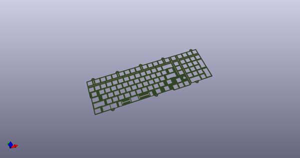
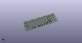
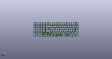
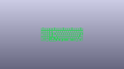
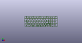
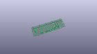

# OOMP Project  
## Austin  by AcheronProject  
  
(snippet of original readme)  
  
- Acheron Austin  
  
  
  
See [this page](https://gondolindrim.github.io/AcheronDocs/austin/intro.html) for the Austin PCB documentation.  
  
-- Introduction  
  
The Austin is a fullsize compact keyboard featuring a variant of the 1800CP layout, designed by PheonixStarr and sold by DriftingMechanics. This repository features the Austin PCB source files.  
  
-- Technical information  
  
- Layout size: fullsize compact  
- Compatible switches: MX-like only, no hotswap capabilities  
- Lighting: per-key single-color through-hole LEDs. Pre-Release Beta also has RGB underglow.  
- Microcontroller: STM32F072(X)(Y)(Z), where:  
  * x can be either 8 (64kB flash variant) or B (128kB flash variant)  
  * Y can be either C (LQFP48 package) or U (UFQFPN48 package)  
  * Z can be either 6 or 7 (higher temperature grade)  
- Connector: fixed USB Type C on the bottom side, no JST connector  
- Firmware compatibility: QMK (with VIA support)  
- Protection hardware:  
  * USB data lines and power rail ESD suppressing  
  * USB power overvoltage protection  
  * Enclosure grounding pad  
  * Overcurrent protection  
  * LDO crowbar diode  
  * EMI suppression (shielding ferrite bead)  
- Current release: pre-Release Beta (has not been prototyped yet)  
- Designer: Gondolindrim  
- License: Acheron Open-Source Hardware License version 1.3  
  
-- Keyboard compatibility and availability  
  
This PCB is designed to be made-to-fit the   
  full source readme at [readme_src.md](readme_src.md)  
  
source repo at: [https://github.com/AcheronProject/Austin](https://github.com/AcheronProject/Austin)  
## Board  
  
  
## Schematic  
  
  
  
[schematic pdf](working_schematic.pdf)  
## Images  
  
  
  
  
  
  
  
  
  
  
