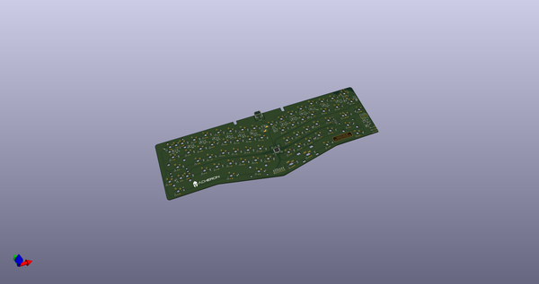
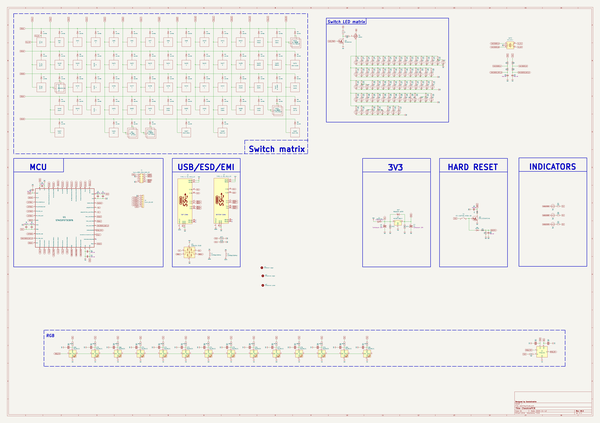
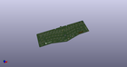
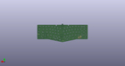
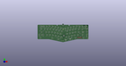

# OOMP Project  
## Cheshire  by AcheronProject  
  
oomp key: oomp_projects_flat_acheronproject_cheshire  
(snippet of original readme)  
  
- Acheron Alice-SM-S-STM32-MX-TH-WI (Codename "Cheshire")  
  
  
  
See [this page](https://gondolindrim.github.io/AcheronDocs/madhatter/intro.html) for the Mad Hatter documentation.  
  
-- Introduction  
  
The Cheshire is an Alice-layout compatible PCB, powered by STM32F072 microprocessor. It supports the default Alice layouts, RGB underglow, three indicator LEDs and single-color, THT per-key LEDs.  
  
-- Icon  
  
The Cheshire logo was made using the  [Alice in Wonderland font](https://www.dafont.com/pt/alice-in-wonderland.font) with slight modifications.  
  
-- Copyright notice  
  
This project is released under the Acheron Open-Hardware License V1.3. For the license, please refer to the LICENCE.md file.  
  
  full source readme at [readme_src.md](readme_src.md)  
  
source repo at: [https://github.com/AcheronProject/Cheshire](https://github.com/AcheronProject/Cheshire)  
## Board  
  
  
## Schematic  
  
  
  
[schematic pdf](working_schematic.pdf)  
## Images  
  
  
  
  
  
  
