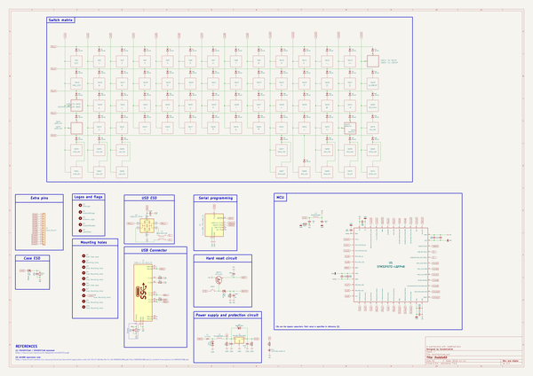

# OOMP Project  
## Doddle60  by AcheronProject  
  
oomp key: oomp_projects_flat_acheronproject_doddle60  
(snippet of original readme)  
  
- Acheron ISO60-SM-S-STM32-MX-TH-WI (Codename "Doddle60")  
  
  
  
See [this page](https://gondolindrim.github.io/AcheronDocs/doddle60/intro.html) for the Doddle60PCB documentation.  
  
-- Introduction  
  
**Doddle**. *British slang for something easily accomplished*.  
  
The Doddle60 is a 60% plain-style PCB aimed at ISO layout users. It features minimal layout support and no LED backlight support. It runs an STM32F072 processor, USBC connector, ESD protection on both data lines and metallic case discharge, as well as overvoltage and overcurrent protection.  
  
The layout was cherry-picked and hinited to me by Jae of the TopClack channel, an avid ISO user brit.  
  
-- Supported layouts  
  
Click [this link](http://www.keyboard-layout-editor.com/-/gists/dfb069e34f7b14d63b03305a79dfc469) for the KLE file for the Doddle60.  
  
  
  
-- Renders  
  
Click at the images to zoom in.  
  
Renders generated by the [tracespace.io](https://tracespace.io/view/) site.  
  
  
  
  
  
  
-- Copyright notice  
  
This project is released under the Acheron Open-Hardware License V1.1. For the license, please ref  
  full source readme at [readme_src.md](readme_src.md)  
  
source repo at: [https://github.com/AcheronProject/Doddle60](https://github.com/AcheronProject/Doddle60)  
## Board  
  
  
## Schematic  
  
  
  
[schematic pdf](working_schematic.pdf)  
## Images  
  
  
  
  
  
  
