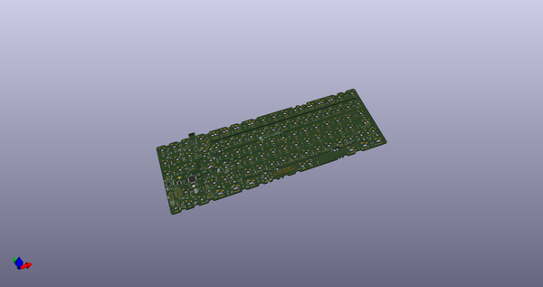
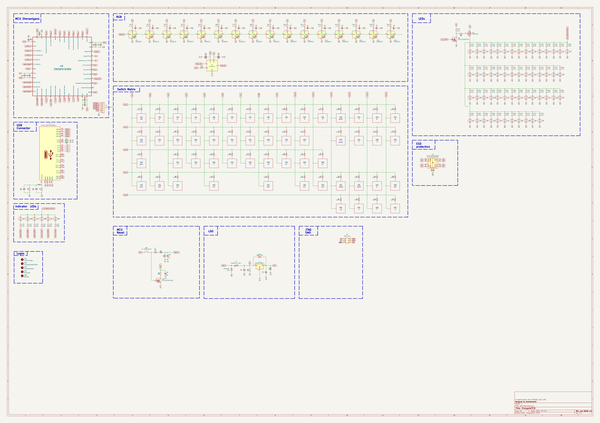
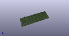
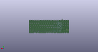
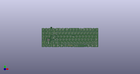

# OOMP Project  
## Elongate  by AcheronProject  
  
(snippet of original readme)  
  
- Acheron 50-SM-S-F072-MX-TH-WI (Codename "Elongate")  
  
  
  
See [this page](https://gondolindrim.github.io/AcheronDocs/elongate/intro.html) for the ElongatePCB documentation.  
  
-- Supported layouts  
  
Click [this link](http://www.keyboard-layout-editor.com/-/gists/a7ea70bf0b0dbade28f4dd3f8dd61796) for the KLE file for Elongate.  
  
  
  
-- Renders  
  
Click at the images to zoom in.  
  
Renders generated by the [tracespace.io](https://tracespace.io/view/) site.  
  
  
  
  
  
  
  
-- Copyright notice  
  
This project is released under the Acheron Open-Hardware License V1.3. For the license, please refer to the LICENCE.md file.  
  
  full source readme at [readme_src.md](readme_src.md)  
  
source repo at: [https://github.com/AcheronProject/Elongate](https://github.com/AcheronProject/Elongate)  
## Board  
  
  
## Schematic  
  
  
  
[schematic pdf](working_schematic.pdf)  
## Images  
  
  
  
  
  
  
