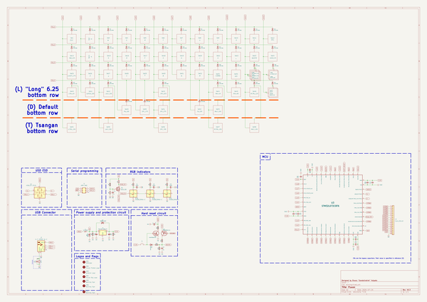

# OOMP Project  
## Fluxon  by AcheronProject  
  
oomp key: oomp_projects_flat_acheronproject_fluxon  
(snippet of original readme)  
  
- Acheron 40-SM-S-STM32-MX-TH-WI (Codename "Fluxon")  
  
  
  
See [this page](https://gondolindrim.github.io/AcheronDocs/fluxon/intro.html) for the Fluxon PCB documentation (still not written yet as of june of 2020).  
  
-- Introduction  
  
The Fluxon is a replacement PCB for the Vortex Core keyboard. It supports the default layouts of the Vortex Core, with a 1.75-2.75 split spacebar. The PCB also supports two extra bottom row layouts: one with a 6.25 spacebar one and other with a 7 unit spacebar. See the picture below for details.   
  
The PCB is powered by a STM32L072CxTx and is QMK compatible.  
  
The indicator LEDs of the stock PCB were substituted by SK6812 (WS2812-compatible controller-integrated seriallized RGB LEDs) which can be configured as per the QMK capabilities.  
  
-- Supported layouts  
  
Click [this link](http://www.keyboard-layout-editor.com/-/gists/73be427d3e8086a9253feece2dae6974) for the KLE file for the Fluxon.  
  
  
  
-- Renders  
  
  
  
  
  
-- Logo  
  
The FLUXON logo was designed using the Deceptibots font by [Iconian Fonts](http://www.iconian.com/index.html). It was licensed f  
  full source readme at [readme_src.md](readme_src.md)  
  
source repo at: [https://github.com/AcheronProject/Fluxon](https://github.com/AcheronProject/Fluxon)  
## Board  
  
  
## Schematic  
  
  
  
[schematic pdf](working_schematic.pdf)  
## Images  
  
  
  
  
  
  
