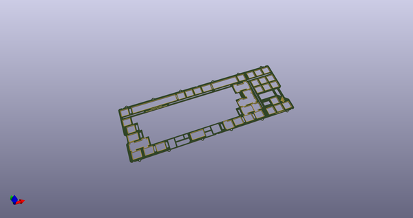
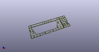
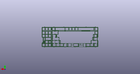
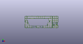

# OOMP Project  
## frog_tkl_plates  by AcheronProject  
  
(snippet of original readme)  
  
- Geonwork Frog TKL plate files  
  
These plate files were handed by Geon from Geonworks -- the designer of the Frog TKL -- knowing that they would be open sourced.  
  
The KiCAD files are of Gondolindrim's authorship. Everything is licensed under the Acheron Open-Hardware License v1.3 . Even so, please contact Geon before using them commercially.  
  
- Structure  
  
The ```./kicad_files``` folder contains the KiCAD files for the FR4 plates; each file should have the explanation. There are   
  
- Universal half-plate  
- ANSI half-plate  
- ISO half-plate  
- Universal full-plate  
- ANSI full-plate  
- ISO full-plate  
  
  full source readme at [readme_src.md](readme_src.md)  
  
source repo at: [https://github.com/AcheronProject/frog_tkl_plates](https://github.com/AcheronProject/frog_tkl_plates)  
## Board  
  
[](working_3d.png)  
## Schematic  
  
[](working_schematic.png)  
  
[schematic pdf](working_schematic.pdf)  
## Images  
  
[](working_3d.png)  
  
[](working_3d_back.png)  
  
[](working_3d_front.png)  
