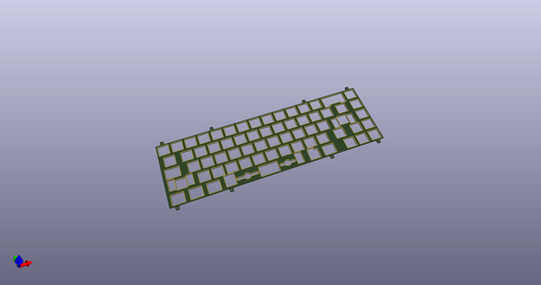
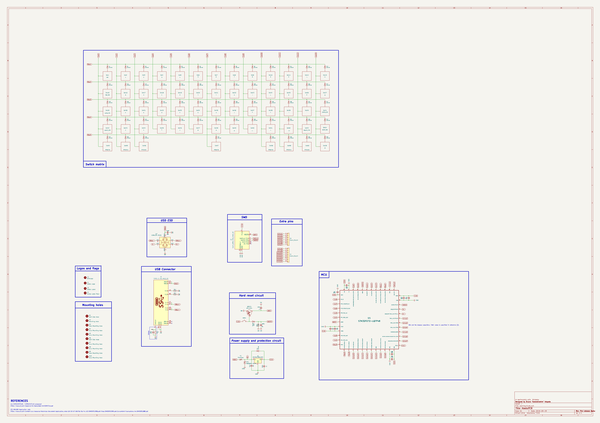
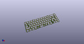
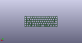
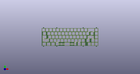

# OOMP Project  
## KeebsPCB  by AcheronProject  
  
(snippet of original readme)  
  
- Acheron 60-SM-S-STM32-MXH-TH-WI (Codename "KeebsPCB")  
  
  
  
See [this page](https://gondolindrim.github.io/AcheronDocs/keebs/intro.html) for the KeebsPCB documentation.  
  
-- Supported layouts  
  
Click [this link](http://www.keyboard-layout-editor.com/-/gists/73be427d3e8086a9253feece2dae6974) for the KLE file for the KeebsPCB.  
  
  
  
-- Renders  
  
Click at the images to zoom in.  
  
Renders generated by the [tracespace.io](https://tracespace.io/view/) site.  
  
  
  
  
  
  
-- Copyright notice  
  
This project is released under the Acheron Open-Hardware License V1.1. For the license, please refer to the LICENCE.md file.  
  
  full source readme at [readme_src.md](readme_src.md)  
  
source repo at: [https://github.com/AcheronProject/KeebsPCB](https://github.com/AcheronProject/KeebsPCB)  
## Board  
  
  
## Schematic  
  
  
  
[schematic pdf](working_schematic.pdf)  
## Images  
  
  
  
  
  
  
