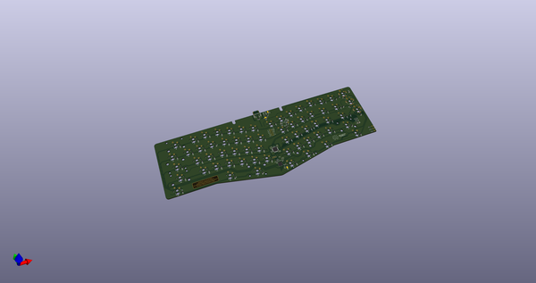
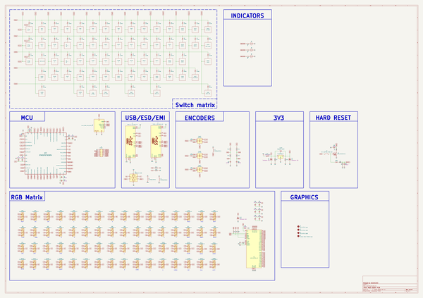
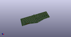
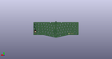
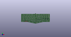

# OOMP Project  
## MadHatter  by AcheronProject  
  
oomp key: oomp_projects_flat_acheronproject_madhatter  
(snippet of original readme)  
  
- Acheron Alice-SM-S-STM32-MX-TH-WI (Codename "Mad Hatter")  
  
  
  
See [this page](https://gondolindrim.github.io/AcheronDocs/madhatter/intro.html) for the Mad Hatter documentation.  
  
-- Introduction  
  
The Mad Hatter is an Alice-layout compatible PCB, originally designed by Raphael Faria for the Lubrigante keyboard. Originally it was an Atmega32U4-powered PCB, using USB mini connector and with no per-key lighting support.  
  
It is currently under redesign by Gondolindrim to use STM32F072CBT6 microprocessor and RGB per-key lighting.  
  
-- Contributors  
  
- [Raphael Faria](https://github.com/raphaelfaria), who was the designer of the first version of the Mad Hatter PCB. His version is available as the [Omicron release](https://github.com/Gondolindrim/mad-hatter/releases/tag/Omicron).   
  
<!--  
-- Supported layouts  
  
Click [this link](http://www.keyboard-layout-editor.com/-/gists/73be427d3e8086a9253feece2dae6974) for the KLE file for the Arctic.  
  
  
  
-- Renders  
  
Click at the images to zoom in.  
  
Renders generated by the [tracespace.io](https://tracespace.io/view/) site.  
  
  
  
  
  
source repo at: [https://github.com/AcheronProject/MadHatter](https://github.com/AcheronProject/MadHatter)  
## Board  
  
  
## Schematic  
  
  
  
[schematic pdf](working_schematic.pdf)  
## Images  
  
  
  
  
  
  
