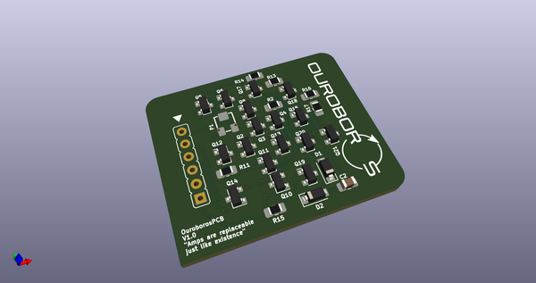
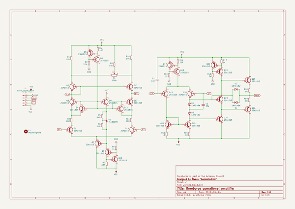
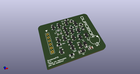
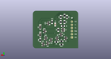
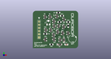

# OOMP Project  
## Ouroboros  by AcheronProject  
  
oomp key: oomp_projects_flat_acheronproject_ouroboros  
(snippet of original readme)  
  
- Acheron Ouroboros  
  

  
     

  
  
See [this page](https://gondolindrim.github.io/AcheronDocs/ouroboros/intro.html) for the Ouroboros documentation (still building).  
  
  full source readme at [readme_src.md](readme_src.md)  
  
source repo at: [https://github.com/AcheronProject/Ouroboros](https://github.com/AcheronProject/Ouroboros)  
## Board  
  
  
## Schematic  
  
  
  
[schematic pdf](working_schematic.pdf)  
## Images  
  
  
  
  
  
  
