# OOMP Project  
## Raphael  by AcheronProject  
  
oomp key: oomp_projects_flat_acheronproject_raphael  
(snippet of original readme)  
  
- Acheron Raphael  
  
-- Introduction  
  
Raphael is a gummy-mount 60% layout PCB supporting both an on-board USB connector and a JST for USB dautherboard connection.  
  
For its full documentation, see [the AcheronDocs page on Raphael](https://acherondocs.com/pcbs/raphael/raphael)  
  
-- Copyright notice  
  
This project is released under the Acheron Open-Hardware License V1.4. For the license, please refer to the LICENCE.md file.  
  
The "angel with sword" logo was licensed through Vectorstock; the license does not allow for redistribution so the source file is not available. The license was obtained in february 08, 2022 and allows for commercial usage of the logo, therefore allowing the PCBs to be used commercially.  
  
  full source readme at [readme_src.md](readme_src.md)  
  
source repo at: [https://github.com/AcheronProject/Raphael](https://github.com/AcheronProject/Raphael)  
## Board  
  
[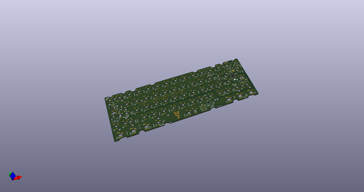](working_3d.png)  
## Schematic  
  
[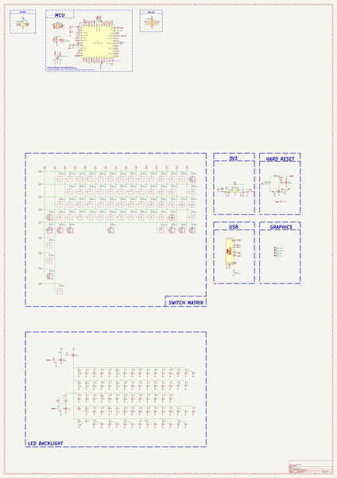](working_schematic.png)  
  
[schematic pdf](working_schematic.pdf)  
## Images  
  
[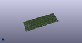](working_3d.png)  
  
  
  
  
  
[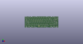](working_3d_front.png)  
  
[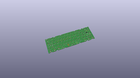](working_3D_top.png)  
  
[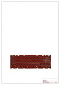](working_assembly_page_01.png)  
  
[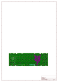](working_assembly_page_02.png)  
  
[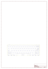](working_assembly_page_03.png)  
  
[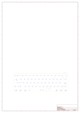](working_assembly_page_04.png)  
  
[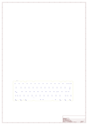](working_assembly_page_05.png)  
  
[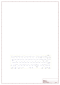](working_assembly_page_06.png)  
