# OOMP Project  
## SharkPCB  by AcheronProject  
  
(snippet of original readme)  
  
- Acheron SharkPCB  
  
The SharkPCB is a 40% ortho-layout PCB conceived as an alternative 40% ortho keyboard that could be easily built and sold in difficult-to-reach markets like the Brazilian market.  
  
Go to the [Acheron Docs](http://acheronproject.com/pcbs/shark/shark/) for the SharkPCB documentation.  
  
  full source readme at [readme_src.md](readme_src.md)  
  
source repo at: [https://github.com/AcheronProject/SharkPCB](https://github.com/AcheronProject/SharkPCB)  
## Board  
  
[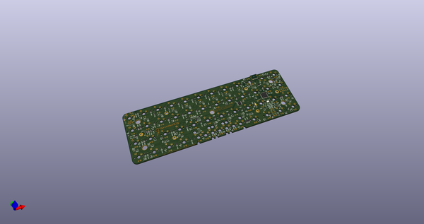](working_3d.png)  
## Schematic  
  
[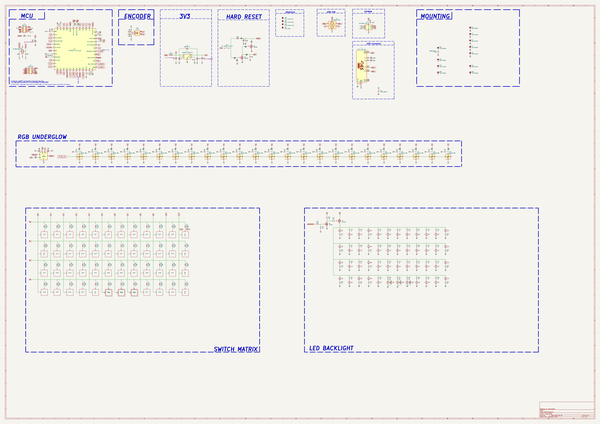](working_schematic.png)  
  
[schematic pdf](working_schematic.pdf)  
## Images  
  
[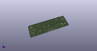](working_3d.png)  
  
[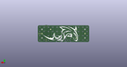](working_3d_back.png)  
  
  
  
[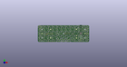](working_3d_front.png)  
  
[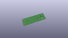](working_3D_top.png)  
  
[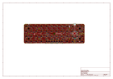](working_assembly_page_01.png)  
  
[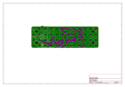](working_assembly_page_02.png)  
  
[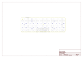](working_assembly_page_03.png)  
  
[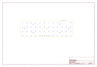](working_assembly_page_04.png)  
  
[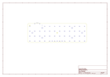](working_assembly_page_05.png)  
  
[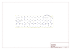](working_assembly_page_06.png)  
