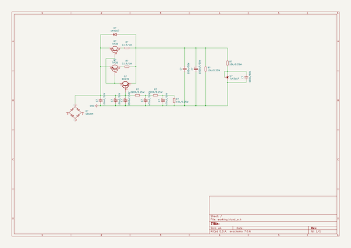

# OOMP Project  
## Zeus  by AcheronProject  
  
(snippet of original readme)  
  
- Zeus linear rectified power supply  
  

  
     

  
  
See [this page](https://gondolindrim.github.io/AcheronDocs/Zeus/inrto.html) for the Zeus documentation.  
  
  full source readme at [readme_src.md](readme_src.md)  
  
source repo at: [https://github.com/AcheronProject/Zeus](https://github.com/AcheronProject/Zeus)  
## Board  
  
  
## Schematic  
  
  
  
[schematic pdf](working_schematic.pdf)  
## Images  
  
  
  
  
  
  
