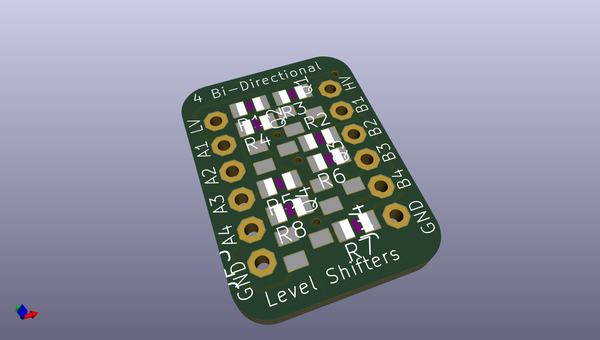

# OOMP Project  
## 4-Channel-Level-Shifter-PCB  by adafruit  
  
(snippet of original readme)  
  
- Adafruit 4 Channel Level Shifter PCB  
<a href="http://www.adafruit.com/products/757">   
Click here to purchase one from the Adafruit shop</a>  
  
This level shifter board combines the ease-of-use of the bi-directional TXB0108 with an I2C-compatible FET design following NXP's app note.  
  
This breakout has 4 BSS138 FETs with 10K pullups. It works down to 1.8V on the low side, and up to 10V on the high side. The 10K's do make the interface a little more sluggish than using a TXB0108 or 74LVC245 so we suggest checking those out if you need high-speed transfer.  
  
While we designed it for use with I2C, this works as well for  TTL Serial,  slow <2MHz SPI, and any other digital interface both uni-directional and bidirectional. Comes with a fully assembled, and tested PCB with 4 full bidirectional converter lines as well as 2 pieces of 6-pin header you can solder on to plug into a breadboard or perfboard.  
  
These are the Eagle CAD files for the Adafruit BSS138-based 4 channel level shifter  
  
--- License  
  
Adafruit invests time and resources providing this open source design, please support Adafruit and open-source hardware by purchasing products from [Adafruit](https://www.adafruit.com)!  
  
All text above must be included in any redistribution  
  
Designed by Limor Fried/Ladyada for Adafruit Industries.  
Creative Commons Attribution/Share-Alike, all text above must be included in any redistribution.   
See license.txt for additional information.  
  
  full source readme at [readme_src.md](readme_src.md)  
  
source repo at: [https://github.com/adafruit/4-Channel-Level-Shifter-PCB](https://github.com/adafruit/4-Channel-Level-Shifter-PCB)  
## Board  
  
  
## Schematic  
  
  
  
[schematic pdf](working_schematic.pdf)  
## Images  
  
  
  
  
  
  
  
  
  
  
  
  
  
  
  
  
