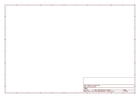

# OOMP Project  
## Adafruit-128x32-SPI-OLED-breakout-board-PCB  by adafruit  
  
oomp key: oomp_projects_flat_adafruit_adafruit_128x32_spi_oled_breakout_board_pcb  
(snippet of original readme)  
  
- Monochrome 128x32 SPI OLED graphic display  
  
<a href="http://www.adafruit.com/products/661"> Click here to purchase one from the Adafruit shop</a>  
  
These displays are small, only about 1" diagonal, but very readable due to the high contrast of an OLED display. This display is made of 128x32 individual white OLED pixels, each one is turned on or off by the controller chip. Because the display makes its own light, no backlight is required. This reduces the power required to run the OLED and is why the display has such high contrast; we really like this miniature display for its crispness!  
  
The driver chip SSD1306, __communicates via SPI only__. 4 or 5 pins are required to communicate with the chip in the OLED display.  
  
The OLED and driver require a 3.3V power supply and 3.3V logic levels for communication. To make it easier for our customers to use, we've added a 3.3v regulator and level shifter on board! This makes it compatible with any 5V microcontroller, such as the Arduino.  
  
The power requirements depend a little on how much of the display is lit but on average the display uses about 20mA from the 3.3V supply. Built into the OLED driver is a simple switch-cap charge pump that turns 3.3v-5v into a high voltage drive for the OLEDs, making it one of the easiest ways to get an OLED into your project!  
  
Of course, we wouldn't leave you with a datasheet and a "good luck": [We have a detailed tutorial](http://learn.adafruit.c  
  full source readme at [readme_src.md](readme_src.md)  
  
source repo at: [https://github.com/adafruit/Adafruit-128x32-SPI-OLED-breakout-board-PCB](https://github.com/adafruit/Adafruit-128x32-SPI-OLED-breakout-board-PCB)  
## Board  
  
  
## Schematic  
  
  
  
[schematic pdf](working_schematic.pdf)  
## Images  
  
  
  
  
  
  
  
  
  
  
  
  
  
  
  
  
