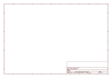
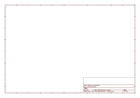

# OOMP Project  
## Adafruit-128x64-Monochrome-OLED-PCB  by adafruit  
  
(snippet of original readme)  
  
-- Adafruit 128x64 Monochrome OLED PCB  
<a href="http://www.adafruit.com/products/326">   
<a href="http://www.adafruit.com/products/326">   
Click here to purchase one from the Adafruit shop</a>  
  
These displays are small, only about 1" diagonal, but very readable due to the high contrast of an OLED display. This display is made of 128x64 individual white OLED pixels, each one is turned on or off by the controller chip. Because the display makes its own light, no backlight is required. This reduces the power required to run the OLED and is why the display has such high contrast; we really like this miniature display for its crispness!  
  
This breakout can be used with either an SPI or I2C interface - selectable by soldering two jumpers on the back. The design is completely 5V-ready, with an onboard regulator and built in boost converter. It's easier than ever to connect directly to your 3V or 5V microcontroller without needing any kind of level shifter!  
  
This is the PCB for the Adafruit 128x64 I2C/SPI/Parallel OLED breakout board. The format is EagleCAD schematic and board layout  
- http://www.adafruit.com/products/326  
  
--- License  
  
Adafruit invests time and resources providing this open source design, please support Adafruit and open-source hardware by purchasing products from [Adafruit](https://www.adafruit.com)!  
  
All text above must be included in any redistribution  
  
Designe  
  full source readme at [readme_src.md](readme_src.md)  
  
source repo at: [https://github.com/adafruit/Adafruit-128x64-Monochrome-OLED-PCB](https://github.com/adafruit/Adafruit-128x64-Monochrome-OLED-PCB)  
## Board  
  
  
## Schematic  
  
  
  
[schematic pdf](working_schematic.pdf)  
## Images  
  
  
  
  
  
  
  
  
  
  
  
  
  
  
  
  
