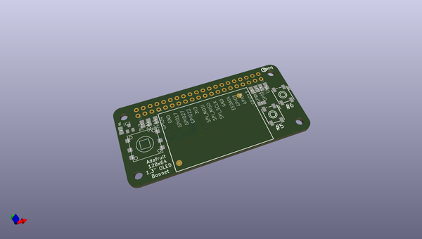
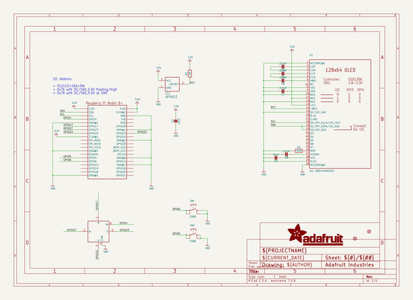
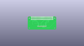
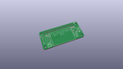
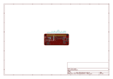
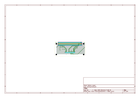
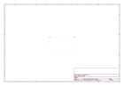
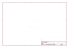
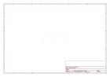
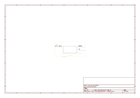

# OOMP Project  
## Adafruit-128x64-OLED-Bonnet-for-Raspberry-Pi-PCB  by adafruit  
  
(snippet of original readme)  
  
-- Adafruit 128x64 OLED Bonnet for Raspberry Pi PCB  
  
<a href="http://www.adafruit.com/products/3531">   
Click here to purchase one from the Adafruit shop</a>  
  
PCB files for the Adafruit 128x64 OLED Bonnet for Raspberry Pi. Format is EagleCAD schematic and board layout  
  
For more details, check out the product page at  
* http://www.adafruit.com/product/3531  
  
--- Description  
  
If you'd like a compact display, with buttons and a joystick - we've got what you're looking for. The Adafruit 128x64 OLED Bonnet for Raspberry Pi is the big sister to our mini PiOLED add-on. This version has 128x64 pixels (instead of 128x32) and a much larger screen besides. With the OLED display in the center, we had some space on either side so we added a 5-way joystick and two pushbuttons. Great for when you want to have a control interface for your project.  
  
These displays are small, only about 1.3" diagonal, but very readable due to the high contrast of an OLED display. This screen is made of 128x64 individual white OLED pixels and because the display makes its own light, no backlight is required. This reduces the power required to run the OLED and is why the display has such high contrast; we really like this miniature display for its crispness!  
  
Please note that this display is too small to act as a primary display for the Pi (e.g. it can't act like or display what would normally be on the HDMI screen). Instead, we recommend using pygame for drawi  
  full source readme at [readme_src.md](readme_src.md)  
  
source repo at: [https://github.com/adafruit/Adafruit-128x64-OLED-Bonnet-for-Raspberry-Pi-PCB](https://github.com/adafruit/Adafruit-128x64-OLED-Bonnet-for-Raspberry-Pi-PCB)  
## Board  
  
  
## Schematic  
  
  
  
[schematic pdf](working_schematic.pdf)  
## Images  
  
  
  
  
  
  
  
  
  
  
  
  
  
  
  
  
