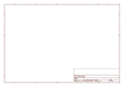

# OOMP Project  
## Adafruit-16-Channel-PWM-Servo-Driver-PCB  by adafruit  
  
oomp key: oomp_projects_flat_adafruit_adafruit_16_channel_pwm_servo_driver_pcb  
(snippet of original readme)  
  
-- Adafruit 16-Channel PWM Servo Driver PCB Eagle Files  
  
<a href="http://www.adafruit.com/products/815">   
Click here to purchase one from the Adafruit shop</a>  
  
This is the PCB for the Adafruit 16-channel PWM/Servo breakout board. Format is EagleCAD schematic and board layout  
For more details, check out the product page at  
* http://www.adafruit.com/products/815  
  
--- Description  
  
You want to make a cool robot, maybe a hexapod walker, or maybe just a piece of art with a lot of moving parts. Or maybe you want to drive a lot of LEDs with precise PWM output. Then you realize that your microcontroller has a limited number of PWM outputs! What now? You could give up OR you could just get this handy PWM and Servo driver breakout.  
  
When we saw this chip, we quickly realized what an excellent add-on this would be. Using only two pins, control 16 free-running PWM outputs! You can even chain up 62 breakouts to control up to 992 PWM outputs (which we would really like to see since it would be glorious)  
  
* It's an i2c-controlled PWM driver with a built in clock. That means that, unlike the TLC5940 family, you do not need to continuously send it signal tying up your microcontroller, its completely free running!  
* It is 5V compliant, which means you can control it from a 3.3V microcontroller and still safely drive up to 6V outputs (this is good for when you want to control white or blue LEDs with 3.4+ forward voltages)  
* 6 address select  
  full source readme at [readme_src.md](readme_src.md)  
  
source repo at: [https://github.com/adafruit/Adafruit-16-Channel-PWM-Servo-Driver-PCB](https://github.com/adafruit/Adafruit-16-Channel-PWM-Servo-Driver-PCB)  
## Board  
  
  
## Schematic  
  
  
  
[schematic pdf](working_schematic.pdf)  
## Images  
  
  
  
  
  
  
  
  
  
  
  
  
  
  
  
  
