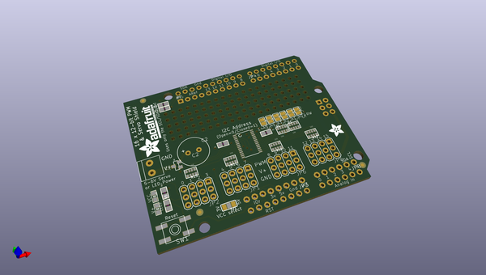
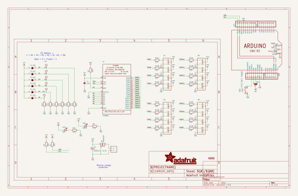
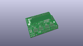
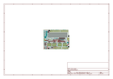
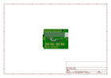
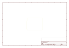
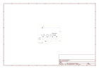

# OOMP Project  
## Adafruit-16-channel-PWM-Servo-Shield  by adafruit  
  
oomp key: oomp_projects_flat_adafruit_adafruit_16_channel_pwm_servo_shield  
(snippet of original readme)  
  
- PCB for the Adafruit 16-channel PWM/Servo shield  
  
__Format is EagleCAD schematic and board layout__  
  
<a href="http://www.adafruit.com/products/1411"> Click here to purchase one from the Adafruit shop</a>  
  
You want to make a cool Arduino robot, maybe a hexapod walker, or maybe just a piece of art with a lot of moving parts. Or maybe you want to drive a lot of LEDs with precise PWM output. Then you realize that the Arduino has only a few PWM outputs, and maybe those outputs are conflicting with another shield! What now? You could give up OR you could just get our handy PWM and Servo driver shield. It's just like our popular PWM/Servo Breakout but now Arduino-ready and works with any Arduino that uses shields: Uno, Leo, Mega, ADK, its all good.  
  
When we saw this chip, we quickly realized what an excellent add-on this would be. __Using only two I2C pins, control 16 free-running PWM outputs!__ You can even stack up 62 shields to control up to 992 PWM outputs (which we would really like to see since it would be glorious and like 4 feet tall) Because I2C is a shared bus you can also connect other I2C devices and sensors to the SCL/SDA pins as long as their addresses don't conflict (this shield has address 0x40)  
  
- There's an I2C-controlled PWM driver with a built in clock. That means that, unlike the TLC5940 family, you do not need to continuously send it signal tying up your microcontroller, its completely free running!  
- It   
  full source readme at [readme_src.md](readme_src.md)  
  
source repo at: [https://github.com/adafruit/Adafruit-16-channel-PWM-Servo-Shield](https://github.com/adafruit/Adafruit-16-channel-PWM-Servo-Shield)  
## Board  
  
  
## Schematic  
  
  
  
[schematic pdf](working_schematic.pdf)  
## Images  
  
  
  
  
  
  
  
  
  
  
  
  
  
  
  
  
